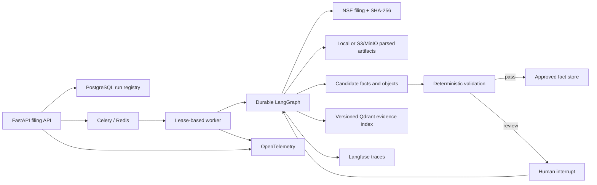

# Lens M1 Implementation

## Status

The M1 production vertical slice is implemented for NSE filing intelligence,
with Infosys (`NSE:INFY`) as the first company. It provides an evidence-first
path from a hash-verified filing to candidate facts, deterministic validation,
human approval where required, approved facts, and cited analysis.

The implementation is suitable for local use and deployment validation. A
production release still requires the environment-specific gates in
“Release checklist”: managed credentials, deployed PostgreSQL/Redis/MinIO,
telemetry destinations, backup/restore validation, security review, and load
testing.

## Delivered architecture



The business database is authoritative. LangGraph checkpoints contain
execution state, not approved business truth. Qdrant contains retrieval
material, not authoritative numeric facts.

## Code map

| Area | Location | Responsibility |
|---|---|---|
| Domain contracts | `src/trade_research/filings/models.py` | Typed documents, runs, facts, evidence, review, and analysis contracts |
| Relational schema | `src/trade_research/filings/tables.py` | Candidate/approved separation, lineage, review, audit, index, and analysis tables |
| Migration | `migrations/versions/20260724_0010_lens_filing_intelligence_m1.py` | M1 database objects |
| Registry | `src/trade_research/filings/registry.py` | Manifest validation, hashing, deduplication, versioning, and supersession |
| Parsers/artifacts | `src/trade_research/filings/parsers.py` | Hardened XBRL/PDF parsing and local/S3 artifact storage |
| Extraction | `src/trade_research/filings/extractors.py` | Canonical XBRL metrics and bounded PDF intelligence objects |
| Validation | `src/trade_research/filings/validators.py` | Evidence, scope, period, duplicate, confidence, and accounting checks |
| Workflow | `src/trade_research/filings/workflow.py` | LangGraph routing, section fan-out, checkpointing, interrupt/resume, and persistence |
| Runtime/queue | `src/trade_research/filings/runtime.py`, `tasks.py` | Claims, leases, heartbeat, cancellation, retry, recovery, and Celery dispatch |
| Retrieval | `src/trade_research/filings/indexing.py` | Versioned chunks, embeddings, Qdrant filters, and index lineage |
| Analysis | `src/trade_research/filings/analysis.py` | Read-only approved-fact tools, calculations, citations, and abstention |
| API | `src/trade_research/filings/api.py` | Import, processing, status, cancellation, reviews, facts, evidence, and analysis |
| Telemetry | `src/trade_research/filings/telemetry.py` | Langfuse observations and OpenTelemetry traces/metrics |

## LangGraph workflow

The graph uses a stable `thread_id` per run and a durable PostgreSQL
checkpointer in deployed environments. SQLite uses an in-memory saver only for
local tests.

```text
authorize
  -> parse
  -> plan_sections
  -> dynamic extract_section fan-out
  -> index_evidence
  -> validate
     -> persist
     -> human_review interrupt
     -> block
```

Every node checks cancellation and updates the worker heartbeat, current node,
progress, and lease. Candidate, evidence, review, and approved-fact writes use
stable identifiers/upserts so retry and replay do not duplicate business
records.

Human review is durable:

1. the graph persists a review request;
2. the run moves to `waiting_review`;
3. LangGraph interrupts;
4. an analyst approves, edits, or rejects through the API;
5. the run is queued with a resume payload; and
6. the graph resumes from its checkpoint and applies the persisted decision.

An `edit` decision is candidate-level and exhaustive. The request must name
every fact and intelligence object in the review packet and assign each one an
`approve`, `edit`, or `reject` action. Omitting an item or adding an unknown
item returns a conflict without closing the review. Edited candidates are
revalidated before approval, and blocking accounting or evidence defects stop
publication.

Example:

```json
{
  "decision": "edit",
  "reason": "Reconciled against the filed XBRL and earnings release.",
  "candidate_decisions": {
    "candidate-uuid-1": {
      "action": "edit",
      "edits": {"value_decimal": "1001"}
    },
    "candidate-uuid-2": {
      "action": "reject"
    }
  },
  "object_decisions": {
    "object-uuid-1": {
      "action": "approve"
    }
  }
}
```

The review payload includes the complete editable fields, validation status,
confidence, and resolved evidence records so a UI does not need to reconstruct
the packet from several eventually inconsistent requests.

## Data safety and evidence policy

- The importer confines manifest paths to the filing pack, verifies byte size
  and SHA-256, and rejects tampering.
- Filing IDs are content-derived and document versions retain supersession
  lineage.
- XBRL facts keep the source concept, context, source hash, filing version, and
  effective date.
- PDF-derived operational metrics, guidance, and management claims require
  human review in M1.
- Candidate facts cannot be queried as approved facts.
- The analysis service only reads approved facts and resolves their evidence.
- If approved evidence is missing, strict mode abstains.
- Workspace IDs constrain documents, runs, reviews, facts, evidence, and
  analysis.
- Raw filing text, prompts, completions, and snippets are redacted from
  telemetry metadata.

## API contract

The filing router is mounted at `/api/filings`.

| Method | Endpoint | Purpose |
|---|---|---|
| `GET` | `/health` | Runtime, queue, checkpoint, and telemetry status |
| `POST` | `/manifests/import` | Admin-only, hash-verified local manifest import |
| `GET` | `/documents` | Workspace-scoped document registry |
| `POST` | `/runs` | Idempotent processing submission |
| `GET` | `/runs` | List runs |
| `GET` | `/runs/{run_id}` | Run status and progress |
| `POST` | `/runs/{run_id}/cancel` | Cooperative cancellation |
| `GET` | `/reviews` | Review queue |
| `GET` | `/reviews/{review_id}` | Review packet |
| `POST` | `/reviews/{review_id}/decision` | Approve, edit, or reject and resume |
| `GET` | `/facts` | Approved facts only |
| `GET` | `/facts/{fact_id}/evidence` | Exact evidence for an approved fact |
| `POST` | `/analysis` | Bounded, cited, read-only financial analysis |
| `POST` | `/admin/recover-stale-runs` | Recover expired worker leases |

Use `X-Workspace-ID` for tenancy and the configured authenticated email header
or `X-Actor-ID` for actor attribution. In production,
`FILING_REQUIRE_WORKSPACE_HEADER=true` should be enabled and admin email
authorization configured.

## Local quick start

Install dependencies and initialize the database:

```bash
uv sync --extra dev
uv run alembic upgrade head
```

For the local inline runtime:

```bash
uv run trade-research import-filing-manifest \
  --manifest data/filings/nse/INFY/manifest.json \
  --workspace-id default
```

List the imported filing IDs and submit one:

```bash
uv run trade-research run-filing-intelligence \
  FILING_ID \
  --workspace-id default
```

The API is available through the normal application:

```bash
uv run uvicorn trade_research.api.app:app --reload
```

The Docker stack selects PostgreSQL checkpointing, Celery/Redis execution, and
MinIO artifact storage:

```bash
docker compose up --build
```

Set real `LANGFUSE_PUBLIC_KEY` and `LANGFUSE_SECRET_KEY` to enable Langfuse.
Set `OTEL_ENABLED=true` to export traces and metrics through the bundled
collector. Qdrant indexing is off by default because it requires a valid
embedding provider key; enable it with `FILING_INDEX_ENABLED=true`.

The production stack uses the corresponding `PROD_FILING_*`,
`PROD_LANGFUSE_*`, `PROD_OTEL_*`, and `PROD_MINIO_*` variables from
`.env.prod.example`. Follow
[`lens_m1_production_acceptance.md`](lens_m1_production_acceptance.md) for
server configuration, the read-only readiness gate, corpus canary, locked
evaluation, backup, and M1 sign-off.

## Operational behavior

Run states are:

```text
accepted -> queued -> running
                     -> waiting_review -> queued -> running -> completed
                     -> retrying -> queued
                     -> completed | failed | cancelled
```

Workers use late Celery acknowledgement, reject work on worker loss, prefetch
one task, acquire a database lease, and send heartbeats. Expired running leases
can be returned to the queue through a workspace-scoped atomic transition.
Each run has a maximum attempt count and stable idempotency key. The production
resilience drill terminates a bounded Celery execution child, verifies task
redelivery to a replacement child, expires a controlled filing lease, and
requires the recovered filing to complete without duplicate approved facts.
It writes a machine-readable report under `/opt/trade/resilience-reports`.

The telemetry contract records:

- end-to-end workflow count and duration;
- node duration;
- extracted object count;
- validation defects by stable rule and severity;
- review decisions;
- resume count;
- run, company, filing, graph, extractor, index, and release identifiers.

## Verification evidence

Automated M1 tests cover:

- hash and byte-size integrity;
- idempotent import and run creation;
- document versioning and supersession;
- NSE `DD-MMM-YYYY` date normalization;
- workspace isolation;
- XBRL parsing and canonical extraction;
- exact concept/context evidence;
- deterministic automatic approval;
- replay without duplicate approved facts;
- durable human interrupt and resume; and
- API idempotency and workspace boundaries.

The real INFY acceptance run used:

```text
INTEGRATED_FILING_INDAS_1658040_23042026090154_WEB.xml
period end: 2026-03-31
scope: consolidated
parse quality: 1.0
candidate facts: 59
approved facts: 59
validation defects: 0
run status: completed
```

The batch acceptance pass then processed all 26 unique INFY financial XBRL
documents in the pack:

```text
completed runs: 26 / 26
failed runs: 0
approved facts across filing versions: 1,186
```

The batch includes the legacy NSE Ind-AS template whose `FourD` context
contains fiscal year-to-date values but repeats the quarter start date.
Normalization derives the Indian fiscal-year start for the candidate while
preserving the original `FourD` context in evidence.

## Locked 13-quarter evaluation gate

The executable seed dataset is:

`evaluations/filings/infy_m1_golden.json`

It covers all 13 consolidated quarters from June 2023 through June 2026. Each
case locks:

- the source filename and SHA-256;
- period and consolidation scope;
- revenue;
- total expenses;
- net profit;
- basic EPS; and
- the exact XBRL concept and context reference for every value.

This is 52 value assertions and 52 evidence assertions. The loader also locks
the source-manifest SHA-256, so changing the corpus invalidates the evaluation
until the dataset is intentionally reviewed and versioned.

Run the gate against an already processed workspace:

```bash
uv run trade-research evaluate-filing-golden \
  --dataset-path evaluations/filings/infy_m1_golden.json \
  --workspace-id default
```

The command emits a structured report and exits non-zero for missing filings,
incorrect cardinality, value/currency differences, or concept/context/source
evidence mismatches.

The current dataset status is
`seeded_from_exact_nse_xbrl_pending_dual_analyst_signoff`. It is technically
locked and executable, but it must not be represented as independently
analyst-approved until two reviewers sign it off.

The complete INFY manifest was also hash-verified and imported:

```text
manifest entries: 124
failed acquisition entries skipped: 1
successful references: 123
unique registered content objects: 108
duplicate-content references deduplicated: 15
supersession links identified: 11
```

## Release checklist

Code-complete does not by itself authorize a production launch. Before
external production traffic:

- run `trade-research verify-filing-production` in the deployed API container;
- run migrations against a production-like PostgreSQL backup;
- validate PostgreSQL checkpoint recovery after worker termination;
- enable strong workspace/actor authentication and rotate MinIO credentials;
- use secret management for Langfuse, OpenAI, database, and object-store keys;
- validate MinIO versioning, encryption, retention, backup, and restore;
- establish PostgreSQL point-in-time recovery and test restoration;
- connect the OpenTelemetry collector and Langfuse project;
- define alert thresholds for failures, stale leases, review age, parse quality,
  extraction defects, latency, and cost;
- execute the locked extraction and analysis evaluation set;
- perform concurrency, queue-backpressure, and large-PDF load tests;
- complete threat modeling, dependency scanning, and penetration testing; and
- canary the INFY corpus before enabling additional NSE companies.

## Known M1 boundaries

- XBRL is the automatic financial-fact path. PDF objects use deterministic
  extraction and human approval.
- Scanned-PDF OCR and table reconstruction are routed by parse quality but are
  not yet implemented as a production OCR service.
- Semantic evidence indexing is available but disabled until Qdrant and an
  embedding provider are configured.
- The analysis service is deliberately bounded and deterministic; broader
  narrative synthesis belongs to a later milestone.
- Only `NSE:INFY` has completed the real-corpus acceptance run.
