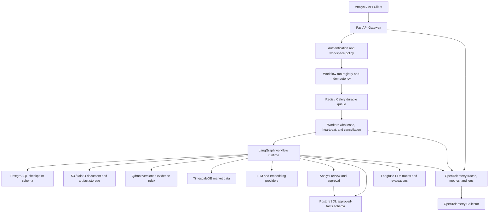
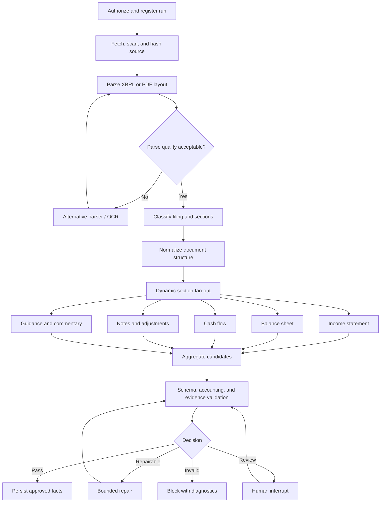

# Lens NSE Filing Intelligence Platform

## Vision, Production Milestone 1, and Delivery Roadmap

Status: Proposed architecture and milestone contract
Scope: NSE-listed companies, beginning with Infosys (`INFY`)
Last updated: 2026-07-24

## 1. Executive Summary

Lens is intended to become an auditable financial-intelligence platform for
Indian listed companies. It will convert NSE filings, annual reports, notes,
quarterly results, earnings material, proxy and governance documents, and
market data into:

- structured and comparable financial facts;
- operational and business KPIs;
- guidance and guidance revisions;
- material events, risks, and accounting adjustments;
- evidence-backed answers to analyst questions; and
- eventually, human-approved research reports and alerts.

The defining product requirement is evidence. Every number and material claim
must resolve to the exact filing version, page, section, table, row, column, or
XBRL concept from which it came.

Lens is not designed as a generic document chatbot. It is a financial
intelligence system with deterministic accounting logic, controlled agent
workflows, durable execution, human approval, complete lineage, and measurable
quality.

## 2. North-Star User Experience

An analyst should eventually be able to ask:

> Why did Infosys operating margin change over the last four quarters, what
> did management attribute it to, how has guidance changed, and how did the
> stock react?

Lens should return:

- the verified quarterly numbers;
- deterministic calculations and reconciliations;
- management's explanations;
- guidance history and revisions;
- market reaction for correctly aligned periods;
- conflicts, limitations, or missing information;
- clickable evidence for every material claim; and
- the data, prompt, model, graph, and retrieval-index versions used.

When the available evidence is insufficient, the system must abstain or return
a clearly qualified partial result rather than manufacture an answer.

## 3. Product Principles

### 3.1 Deterministic financial truth

XBRL parsing, accounting calculations, unit conversion, sign normalization,
period matching, and validation must be code-driven. Models may map unfamiliar
labels and interpret commentary, but they must not be the authoritative source
of accounting arithmetic.

### 3.2 Agents operate over approved facts

The analysis agent reads approved structured facts and retrieved evidence. An
LLM-extracted candidate cannot silently become approved financial truth.

### 3.3 Evidence is a first-class object

A fact is incomplete without its filing version, source hash, location, period,
scope, extraction lineage, validation result, and review status.

### 3.4 Workflows are durable and replay-safe

Filing processing must survive worker crashes, provider failures, duplicate
messages, restarts, and long analyst-review periods. LangGraph checkpoints use
a stable `thread_id`; nodes that may be replayed must be idempotent.

References:

- [LangGraph persistence](https://docs.langchain.com/oss/python/langgraph/persistence)
- [LangGraph interrupts](https://docs.langchain.com/oss/python/langgraph/interrupts)
- [LangGraph functional API](https://docs.langchain.com/oss/python/langgraph/functional-api)

### 3.5 Human accountability remains explicit

Low-confidence, conflicting, or policy-sensitive outputs go to an analyst for
approve, edit, or reject. The platform records the user, decision, previous
value, new value, reason, and timestamp.

### 3.6 Quality is continuously measured

Prompts, models, extraction logic, retrieval configuration, and index versions
cannot be promoted without passing a versioned evaluation dataset and defined
release gates.

### 3.7 Tenant isolation is enforced below the prompt

Workspace, company, filing-version, and period restrictions are enforced in
the API, SQL layer, tool registry, and vector-index filters. They are not
delegated to LLM instructions.

## 4. Target Architecture



### 4.1 Ownership boundaries

- **FastAPI** accepts, authorizes, validates, and registers work. It returns
  `202 Accepted` for asynchronous workflows and exposes status, cancellation,
  review, and result APIs.
- **Redis and Celery** distribute work, enforce backpressure, and handle
  delivery and retry semantics.
- **Workers** own execution leases, heartbeats, cancellation checks, and safe
  recovery.
- **LangGraph** owns workflow state, routing, conditional edges, bounded loops,
  fan-out, aggregation, and human interrupts.
- **PostgreSQL checkpoint schema** owns execution snapshots. It is not the
  source of approved business truth.
- **PostgreSQL business schemas** own filing registrations, candidate facts,
  approved facts, evidence, reviews, audit records, and workflow-run status.
- **Object storage** owns original documents, parser artifacts, page images,
  OCR output, and other large immutable artifacts.
- **Qdrant** owns versioned semantic evidence. It is not authoritative for
  numeric facts.
- **TimescaleDB** owns market-price and return series.
- **Langfuse** owns model, prompt, retrieval, tool, and evaluator traces.
- **OpenTelemetry** owns service, worker, queue, database, network, and runtime
  telemetry.

## 5. Principal Workflows

The mature platform contains four cooperating graphs.

### 5.1 Filing Document Intelligence Graph

This graph ingests a filing and produces validated, reviewed, evidence-linked
business objects.



### 5.2 Financial Analysis Agent

This graph answers questions using a bounded tool loop:

```text
question
  -> authorization
  -> intent and risk classification
  -> evidence plan
  -> bounded tool execution
  -> evidence sufficiency check
  -> deterministic calculations
  -> cited synthesis
  -> citation, faithfulness, and policy validation
  -> answer, qualified partial answer, or abstention
```

Approved read tools include:

- approved financial-fact SQL;
- deterministic ratio and variance calculations;
- filing evidence retrieval;
- filing-version comparison;
- Timescale market-data queries; and
- data-quality and freshness checks.

### 5.3 Evaluation and Policy Graph

This graph evaluates extraction and analysis artifacts in parallel:

- schema validation;
- accounting-rule validation;
- evidence and citation validation;
- retrieval evaluation;
- faithfulness evaluation;
- tool-trajectory evaluation; and
- security and policy evaluation.

It aggregates a structured scorecard and routes the result to pass, repair,
human review, block, or alert.

### 5.4 Research Memo Approval and Publication Graph

This later graph produces versioned research artifacts:

```text
approved facts and evidence
  -> parallel memo sections
  -> cross-section consistency
  -> human approve / edit / reject
  -> deterministic Markdown and PDF rendering
  -> publication
  -> transactional outbox
  -> optional notification
```

Publication and external actions require explicit approval, versioning,
idempotency, and delivery receipts.

## 6. Evidence and Business Data Model

### 6.1 Canonical objects

The platform uses typed contracts for:

- `FinancialFact`
- `OperationalMetric`
- `Guidance`
- `Adjustment`
- `CorporateEvent`
- `GovernanceResolution`
- `RiskDisclosure`
- `ManagementClaim`
- `EvidenceReference`

### 6.2 Financial fact

A financial fact includes at least:

```text
metric_id
canonical_metric
reported_label
value
currency
unit_scale
period_start
period_end
period_type
consolidation_scope
source_filing_id
source_filing_version
evidence_refs[]
confidence
validation_status
review_status
extractor_version
prompt_version
created_at
```

### 6.3 Evidence reference

Every evidence reference identifies the precise source:

```text
workspace_id
company_id
filing_id
filing_version
page
section_path
table
row
column
xbrl_concept
chunk_id
source_hash
effective_date
```

The UI and API must be able to resolve the reference to the exact page, table,
row, or XBRL concept.

## 7. Required Deterministic Validation

The first rule set includes:

- assets approximately equal liabilities plus equity;
- gross profit approximately equal revenue minus cost where applicable;
- free cash flow equals operating cash flow minus capex under the declared
  platform definition;
- period and comparative correctness;
- standalone versus consolidated scope;
- currency and unit scale;
- sign normalization;
- duplicate and conflicting metrics;
- current versus prior period;
- ratios calculated only from approved facts;
- every published material claim has evidence; and
- market-performance windows align with the relevant event time and trading
  calendar.

LLMs may assist with semantic label mapping, management-commentary extraction,
and conflict explanation. They do not perform authoritative accounting
arithmetic.

## 8. Milestone 1: INFY Production Vertical Slice

### 8.1 Outcome

For Infosys only, Lens must reliably turn the available three-year NSE source
pack into an analyst-approved 13-quarter intelligence dataset and answer a
bounded set of financial questions with exact citations.

The current source foundation contains:

- 123 documents;
- 79 PDFs and 44 XML files;
- FY2023-24 through FY2025-26;
- the latest Q1 FY2026-27 material; and
- original and revised filing versions.

The source manifest is:

`data/filings/nse/INFY/manifest.json`

The reusable downloader is:

`scripts/fetch_nse_filing_pack.py`

### 8.2 M1 supported document classes

M1 supports the Infosys instances of:

1. annual statements and annual reports;
2. notes to annual statements;
3. proxy, governance, and shareholder-meeting documents;
4. quarterly statements and results;
5. earnings releases, presentations, and related material.

### 8.3 M1 extraction target

For each quarter, extract and reconcile approximately:

- 30-40 core financial facts;
- 15-20 business and operational metrics;
- revenue and margin guidance;
- guidance revisions;
- material adjustments and exceptional items;
- capital-allocation events;
- important management explanations; and
- material governance and risk events.

Core financial coverage includes:

- revenue;
- operating profit and operating margin;
- net profit;
- EPS;
- cash and debt;
- assets and equity;
- operating cash flow;
- capex and free cash flow;
- dividends; and
- buybacks.

Infosys-specific operational coverage includes:

- large-deal total contract value;
- employee count;
- attrition;
- utilization;
- geography and industry mix;
- client concentration;
- pricing commentary;
- AI-related disclosures; and
- management guidance and subsequent revisions.

### 8.4 M1 LangGraph implementation

M1 implements the Filing Document Intelligence Graph completely enough for the
supported INFY documents. It includes:

- typed, minimal, JSON-serializable graph state;
- a stable UUID `thread_id`;
- a PostgreSQL production checkpointer;
- raw documents and large parsed artifacts outside graph state;
- dynamic section fan-out;
- reducers for candidate aggregation;
- bounded repair attempts;
- human `interrupt()` for approve, edit, and reject;
- replay-safe nodes;
- idempotent database persistence;
- separate checkpoint and approved-business schemas;
- explicit retry and tool budgets; and
- cancellation checks between expensive operations.

Suggested minimal graph state:

```text
run_id
thread_id
workspace_id
company_id
filing_id
filing_version
object_refs
section_jobs
candidate_fact_refs
validation_defects
retry_budget
review_decision
graph_version
prompt_versions
model_versions
index_version
status
```

Raw filing text and page images must not be carried inside checkpoint state.

### 8.5 M1 API and queue contract

The API provides:

- submit filing-processing run;
- retrieve run status and progress;
- cancel a run;
- retrieve pending review;
- approve, edit, or reject review;
- retrieve approved filing intelligence;
- ask a bounded financial question; and
- retrieve complete answer evidence.

Workflow lifecycle:

```text
accepted
  -> queued
  -> running
  -> waiting_review | retrying
  -> completed | failed | cancelled
```

Run registration requires a client or server-generated idempotency key.
Persistence uses unique business keys and upserts so duplicate queue delivery
cannot duplicate approved facts.

Workers use:

- bounded concurrency;
- per-workspace backpressure;
- lease acquisition and expiry;
- periodic heartbeat;
- late acknowledgement only for idempotent tasks;
- retry classification;
- cancellation checks; and
- dead-letter diagnostics.

### 8.6 M1 analysis agent

M1 includes a read-only Financial Analysis Agent with:

- approved-fact SQL;
- deterministic ratio and variance calculator;
- filing evidence retrieval;
- filing-version comparison; and
- data-quality and run-status lookup.

The agent has explicit limits for:

- tool calls;
- loop iterations;
- total time;
- tokens;
- cost; and
- repair attempts.

It cannot publish research, send notifications, place trades, or execute
external actions.

### 8.7 M1 human review

The reviewer can:

- inspect proposed and existing values;
- view exact page, table, and XBRL evidence;
- compare original and revised filings;
- inspect validation defects;
- approve, edit, or reject;
- record a reason for material edits; and
- resume a paused LangGraph run.

Every action is immutable and attributable to a user.

## 9. Langfuse Design

Use one Langfuse trace per user-visible operation.

Document-processing example:

```text
filing.document.intelligence
  authorize
  register
  parse
  section_fanout
    extract.income_statement
    extract.balance_sheet
    extract.cash_flow
    extract.guidance
  validate
  human_review
  persist
```

Analysis example:

```text
financial.analysis.question
  classify
  evidence_plan
  sql_tool
  retriever
  calculator
  synthesis
  citation_evaluator
  faithfulness_evaluator
```

Trace metadata includes:

- run, thread, workspace, and company identifiers;
- filing ID and version;
- release or Git SHA;
- graph version;
- prompt versions;
- model and embedding versions;
- index and chunking versions;
- token usage, latency, and estimated cost;
- retrieval ranks and filters;
- tool arguments and outcomes;
- validation and approval results; and
- retry and error information.

Trace names remain stable and low-cardinality. IDs are metadata, not trace
names.

Raw filing text should be masked or omitted from hosted telemetry by default.
Exact source evidence remains in platform-controlled storage.

References:

- [Langfuse observability](https://langfuse.com/docs/observability/overview)
- [Langfuse experiments](https://langfuse.com/docs/evaluation/experiments/data-model)
- [Langfuse code evaluators](https://langfuse.com/docs/evaluation/evaluation-methods/code-evaluators)
- [Langfuse LLM-as-a-Judge](https://langfuse.com/docs/evaluation/evaluation-methods/llm-as-a-judge)

## 10. OpenTelemetry and Operational Telemetry

Trace context propagates through:

```text
HTTP request
  -> workflow run
  -> Celery message
  -> worker
  -> LangGraph node
  -> parser, model, or tool
  -> PostgreSQL, Qdrant, object storage, or external provider
```

OpenTelemetry provides vendor-neutral traces, metrics, and logs. An
OpenTelemetry Collector receives, processes, scrubs, samples, and exports the
telemetry.

References:

- [OpenTelemetry documentation](https://opentelemetry.io/docs/)
- [OpenTelemetry Collector overview](https://opentelemetry.io/docs/specs/otel/overview/)

### 10.1 Dashboards

M1 requires three operational dashboards.

#### Reliability

- queue depth and oldest-message age;
- run status and duration;
- worker heartbeats and expired leases;
- retries and cancellations;
- node failures; and
- checkpoint resumes.

#### Quality

- candidate extraction accuracy;
- evidence coverage;
- validation defects;
- repair rate;
- human edit and reject rate;
- citation accuracy; and
- unsupported-claim rate.

#### Cost and performance

- workflow and node latency;
- model latency;
- tokens and embeddings;
- cost per filing and question; and
- provider errors and rate limits.

### 10.2 Initial metrics

```text
workflow_runs_total{graph,status}
workflow_duration_seconds{graph}
workflow_resume_total{graph}
queue_depth{queue}
queue_oldest_message_seconds{queue}
worker_lease_expired_total
node_duration_seconds{graph,node}
extraction_candidates_total{object_type}
validation_defects_total{rule}
evidence_coverage_ratio{object_type}
review_decisions_total{decision}
llm_tokens_total{model,direction}
llm_cost_total{model}
provider_errors_total{provider,error_class}
```

High-cardinality identifiers such as `run_id`, `thread_id`, and `filing_id`
belong in structured logs and traces, not metric labels.

### 10.3 Initial alerts

- excessive queue age;
- repeated workflow failure;
- missing worker heartbeat or expired lease;
- provider failure or rate-limit spike;
- abnormal validation-defect rate;
- evidence coverage below the release threshold;
- excessive human rejection rate; and
- unexpected cost increase.

## 11. M1 Evaluation Strategy

Create a locked dataset containing at least:

- 350 verified numeric facts across 13 quarters;
- 50 operational or guidance facts;
- 30 analyst questions;
- 10 hard-negative or missing-information questions;
- revised-filing and supersession cases;
- unit ambiguity;
- current-versus-prior-period confusion;
- standalone-versus-consolidated confusion;
- OCR and multi-page table extraction;
- prompt-injection text inside a filing;
- cross-workspace access attempts; and
- worker failure and duplicate-message cases.

Use deterministic evaluators for:

- JSON and schema validity;
- exact numeric match;
- accounting rules;
- period, scope, currency, unit, and sign;
- required evidence;
- citation resolution;
- tool arguments; and
- access-control filters.

Use calibrated LLM judges only for semantic properties such as:

- commentary faithfulness;
- explanation relevance;
- unsupported semantic claims;
- conflict explanation; and
- synthesis quality.

Judge scores must be calibrated periodically against human review.

## 12. M1 Release Gates

M1 is complete only when every required gate passes.

### 12.1 Data quality

- 100% of source documents are registered, hashed, and versioned.
- 100% of approved material facts have resolvable evidence.
- Automated exact-match accuracy is at least 98.5% on the locked numeric set.
- Material facts are 100% correct after human approval.
- There is no unresolved period, scope, currency, or unit ambiguity.
- Revised filings supersede earlier versions without deleting them.

### 12.2 Analysis quality

- Correctness is at least 95% on the locked analyst-question set.
- 100% of material answer claims are cited.
- There are zero unsupported numerical claims.
- Every hard-negative case produces the expected abstention.
- Ratios use approved facts only.

### 12.3 Reliability

- A worker death resumes from a durable checkpoint.
- Duplicate queue delivery does not duplicate facts.
- A crash after database commit but before acknowledgement remains safe.
- A human review can remain paused and resume later.
- One failed parallel section does not corrupt completed sections.
- Cancellation during fan-out reaches a correct terminal state.
- Provider failure is bounded and produces an actionable diagnostic.
- Every terminal failure records its cause and last successful stage.

Required reliability drills:

1. kill a worker after a model response but before persistence;
2. kill a worker after persistence but before queue acknowledgement;
3. resume after a long human interrupt;
4. deliver the same queue message twice;
5. fail one parallel financial section;
6. fail a provider during a run;
7. change a prompt label while an older run remains active; and
8. cancel a run during section fan-out.

Success means approved business state remains correct, not merely that the
graph eventually returns.

### 12.4 Security

- Cross-workspace SQL and retrieval leakage is zero.
- Company and filing-version filters are enforced in SQL and vector queries.
- Filing content is handled as untrusted input.
- Secrets and raw documents are absent from exported telemetry.
- Tool permissions are allow-listed and read-only for the M1 analysis agent.

### 12.5 Operations

- Run-registration API p95 latency is below 500 milliseconds under the agreed
  M1 load profile.
- Processing remains asynchronous.
- Every user-visible operation has a correlated `run_id`, OpenTelemetry trace,
  and Langfuse trace.
- Alerts exist for queue delay, orphaned workers, provider failure, abnormal
  validation rates, and cost spikes.
- A prompt, model, or index canary and rollback is demonstrated.

## 13. M1 Non-Goals

M1 does not include:

- support for every NSE company;
- autonomous investment recommendations;
- automatic publication of research;
- email, messaging, broker, or trading actions;
- portfolio screening;
- multi-region disaster recovery;
- unbounded multi-agent research; or
- fully automatic approval of low-confidence financial facts.

## 14. Delivery Roadmap

### M0: Source foundation

Objective: establish a trustworthy INFY document corpus.

Deliverables:

- NSE filing discovery and download;
- local source pack;
- hashes and manifest;
- file-integrity validation; and
- reusable downloader.

Exit condition: complete source inventory with reproducible acquisition.

Current status: substantially complete.

### M1: INFY production vertical slice

Objective: filing to approved facts to cited answers.

Deliverables:

- production Filing Document Intelligence Graph;
- Postgres checkpointing;
- durable queue and worker recovery;
- evidence-linked business schemas;
- deterministic validation;
- human review;
- minimal read-only Financial Analysis Agent;
- Langfuse and OpenTelemetry;
- locked evaluation dataset; and
- production release gates.

Exit condition: all gates in Section 12 pass.

### M2: Complete INFY research intelligence

Objective: cover the complete company-level research workflow.

Deliverables:

- deeper financial-note extraction;
- proxy and governance coverage;
- earnings commentary and management-claim history;
- complete guidance history;
- filing-version change analysis;
- market-reaction tools using TimescaleDB;
- mature Financial Analysis Agent;
- mature Evaluation and Policy Graph; and
- 50-100 labeled questions split into development, locked regression,
  red-team, and production-failure sets.

Exit condition: an analyst can reproduce a complete quarterly review and
three-year company trend analysis from Lens.

### M3: NSE multi-company pilot

Objective: generalize the system beyond Infosys.

Deliverables:

- onboarding for 25-50 companies;
- sector-specific metric taxonomies;
- document-source scheduling;
- company and filing-type mapping policies;
- workspace quotas and backpressure;
- per-company data-quality scorecards;
- strict retrieval isolation;
- load and concurrency testing; and
- controlled prompt, model, and index rollout.

Exit condition: a new supported company is onboarded primarily through
configuration and mappings rather than company-specific application code.

### M4: Research memo approval and publication

Objective: convert approved intelligence into controlled research artifacts.

Deliverables:

- Research Memo Approval and Publication Graph;
- parallel memo-section generation;
- cross-section consistency validation;
- human approve, edit, and reject;
- versioned Markdown and PDF artifacts;
- publication audit trail;
- transactional outbox; and
- duplicate-delivery protection.

Exit condition: every published memo is reproducible, editable, evidence-backed,
and auditable.

### M5: Continuous NSE intelligence

Objective: detect and explain meaningful changes as new filings arrive.

Deliverables:

- NSE ingestion scheduler and monitoring;
- amendment and supersession detection;
- guidance-change alerts;
- material-event extraction;
- event-to-market-window alignment;
- Timescale market-reaction analysis;
- notification policies; and
- ingestion and alerting SLOs.

Exit condition: new supported filings are detected, processed, reviewed, and
surfaced within the agreed service-level objective.

### M6: Institutional platform

Objective: support broader production and commercial usage.

Deliverables:

- NIFTY-scale and broader NSE coverage;
- tenant administration;
- high availability and disaster recovery;
- retention, deletion, and audit-export policies;
- model-provider abstraction;
- cost and capacity governance;
- portfolio comparisons and screeners; and
- organization-level access and approval controls.

Exit condition: the platform meets the agreed availability, recovery, security,
governance, and cost objectives.

## 15. Recommended M1 Build Order

1. Freeze canonical schemas and evidence contracts.
2. Implement filing registry, source hashing, and version rules.
3. Implement deterministic XBRL and PDF parsing.
4. Build the Filing Document Intelligence LangGraph.
5. Add the PostgreSQL checkpointer and workflow-run registry.
6. Add deterministic validation and the human-review interrupt.
7. Persist candidate and approved facts idempotently.
8. Build the minimal read-only Financial Analysis Agent.
9. Add Langfuse, OpenTelemetry, dashboards, and alerts.
10. Build the locked evaluation dataset.
11. Run reliability, security, and cross-workspace drills.
12. Demonstrate a canary release and rollback.

## 16. Definition of Done for the Platform Direction

The architecture is fulfilling its purpose when:

- workflows resume safely after worker death;
- duplicate execution does not duplicate approved facts or publications;
- analysts can approve, edit, or reject after a durable pause;
- every material fact resolves to exact evidence;
- extraction and retrieval variants are evaluated on versioned datasets;
- tool selection and arguments are measured;
- traces contain graph, model, retrieval, tool, validation, and approval data;
- prompt, model, and index versions can be compared and rolled back;
- cross-workspace retrieval isolation is proven;
- approved business truth remains separate from execution checkpoints;
- research artifacts are editable, versioned, and auditable; and
- failures produce actionable diagnostics rather than fabricated answers.
