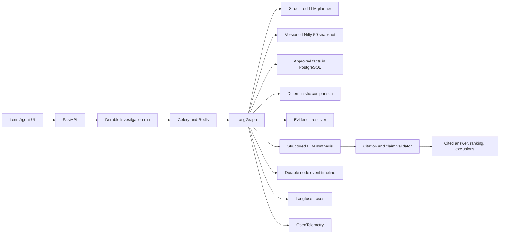

# Nifty 50 Filing Investigation Agent

## Purpose

This vertical slice turns the M1 filing-intelligence platform into an
evidence-grounded market investigation agent. An analyst can ask a bounded
cross-company question such as:

> Rank Nifty 50 companies by year-over-year consolidated net-profit growth.

The system plans the investigation, resolves a versioned Nifty 50 universe,
queries approved financial facts, performs deterministic comparisons, resolves
the exact filing evidence, asks an LLM to synthesize the supported result, and
validates every generated claim before returning it.

The LLM is not the calculator, database, or source of truth. It is used only
for constrained planning and narrative synthesis. Universe membership,
financial values, period alignment, rankings, percentage changes, exclusions,
and citations remain deterministic.

## Production architecture



The LangGraph state contract is `InvestigationGraphState` in
`src/trade_research/filings/agent_workflow.py`. Its durable path is:

```text
plan
  -> resolve_universe
  -> compare
  -> resolve_evidence
  -> synthesize
  -> validate_claims
  -> finalize
```

Every node records status, progress, and a sanitized detail payload in
PostgreSQL. LangGraph uses the existing production PostgreSQL checkpointer,
while the business result remains in the investigation tables.

## Agent boundaries

The first version intentionally supports a narrow, reliable tool surface:

- universe: a locked `NIFTY50` snapshot with exactly 50 constituents;
- metrics: revenue, net profit, profit before tax, basic EPS, and diluted EPS;
- comparisons: quarter over quarter and year over year;
- scope: consolidated quarterly facts;
- source: current, approved facts with filing-level evidence;
- output: a ranked comparison, exclusions, structured claims, and citations.

Companies without compatible periods or complete evidence are excluded and
reported. In strict-evidence mode, unsupported claims are removed. An LLM
failure falls back to a deterministic plan and synthesis, so provider
availability cannot corrupt or block the numeric result.

The workflow makes at most two LLM calls per investigation: one planner call
and one synthesis call. It never makes an LLM call per company.

## Data acquisition and preparation

Create a fresh, source-hashed Nifty 50 snapshot from the official NSE archive:

```bash
uv run python scripts/fetch_nifty50_snapshot.py \
  --output data/filings/nse/NIFTY50/snapshot.json
```

Fetch the latest five bounded quarterly XBRL windows for all constituents:

```bash
uv run python scripts/fetch_nifty50_filing_pack.py \
  --snapshot data/filings/nse/NIFTY50/snapshot.json \
  --output-root data/filings/nse \
  --quarters 5 \
  --throttle-seconds 1 \
  --continue-on-error
```

The batch fetch writes a machine-readable acquisition report beneath
`data/filings/nse/NIFTY50`. Failed companies are explicit and can be retried;
the run does not silently invent coverage.

After transferring the data to production, import the snapshot and all
available manifests:

```bash
docker compose --env-file /opt/trade/.env -f docker-compose.prod.yml \
  exec -T api trade-research import-filing-universe-pack \
  /app/data/filings/nse/NIFTY50/snapshot.json \
  --filing-root /app/data/filings/nse \
  --workspace-id default \
  --verify-hashes \
  --import-only
```

Queue at most five current quarterly XBRL documents per company by replacing
`--import-only` with `--enqueue`. Repeating the command is safe: extraction
runs use stable idempotency keys derived from the universe snapshot and filing.

## LLM configuration

The agent supports OpenAI and Gemini through a provider-neutral structured
JSON boundary. The default is disabled so existing deterministic M1 processing
continues without an external model.

For OpenAI:

```dotenv
PROD_FILING_AGENT_LLM_ENABLED=true
PROD_FILING_AGENT_LLM_PROVIDER=openai
PROD_FILING_AGENT_LLM_MODEL=gpt-4o-mini
PROD_OPENAI_API_KEY=replace-with-secret
```

For Gemini:

```dotenv
PROD_FILING_AGENT_LLM_ENABLED=true
PROD_FILING_AGENT_LLM_PROVIDER=gemini
PROD_FILING_AGENT_LLM_MODEL=gemini-2.5-flash
PROD_GEMINI_API_KEY=replace-with-secret
```

Restart `api` and `filing-worker` after changing the environment. Never commit
provider keys. The prompt version, provider, model, status, latency, and token
usage are recorded; prompts, raw document text, evidence snippets, and model
completions are not sent to telemetry metadata.

## API and UI

The user-facing route is `/lens`. It includes:

- bounded investigation presets and a question composer;
- live Nifty 50 coverage and exclusion counts;
- durable LangGraph node progress;
- the typed LLM plan and exact bounded tool trajectory;
- cited synthesis and deterministic ranking;
- an evidence drawer with filing ID/version, XBRL concept, context, source
  hash, and source snippet;
- explicit exclusions with machine-readable reasons;
- seven validation gates and a persisted five-suite evaluation scorecard.

API endpoints:

| Method | Endpoint | Purpose |
|---|---|---|
| `POST` | `/api/filings/universes/snapshots` | Admin import of a locked universe |
| `GET` | `/api/filings/universes/{id}/coverage` | Coverage and company eligibility |
| `POST` | `/api/filings/investigations` | Idempotent investigation submission |
| `GET` | `/api/filings/investigations/{id}` | Durable run and result |
| `GET` | `/api/filings/investigations/{id}/events` | Node event timeline |
| `GET` | `/api/filings/investigations/{id}/validation` | Recomputed runtime gates |
| `POST` | `/api/filings/investigations/{id}/evaluations` | Persisted quality evaluation |
| `GET` | `/api/filings/investigations/{id}/evaluations/latest` | Latest scorecard |

CLI can submit the same workflow:

```bash
trade-research run-filing-investigation \
  "Rank Nifty 50 companies by year-over-year consolidated net-profit growth." \
  --workspace-id default \
  --universe-id NIFTY50 \
  --comparison yoy
```

## Demo runbook

Before the demo:

1. verify production readiness;
2. open `/lens` and confirm the coverage card;
3. run the net-profit-growth preset once as a canary;
4. confirm the completed trace in Langfuse;
5. keep one completed investigation ID as a fallback.

During the demo:

1. show that the universe is a dated, hashed NSE snapshot;
2. submit the year-over-year net-profit-growth investigation;
3. let the graph timeline demonstrate planning and tool use;
4. show the ranking and explain excluded companies;
5. open a citation and show its XBRL concept, period, source hash, and snippet;
6. show all validation gates and run the persisted quality scorecard;
7. open Langfuse and correlate the trace without exposing raw filing text.

The honest claim is: this is a production-architected, evidence-grounded agent
running over the subset of Nifty 50 companies whose filing packs have been
ingested and validated. Do not claim full Nifty 50 coverage until the UI
coverage gate reports it.

## Acceptance gates

The feature is demo-ready when:

- migration `20260726_0012` is at head;
- the Nifty 50 snapshot contains exactly 50 unique symbols;
- acquisition/import reports enumerate successes and failures;
- the coverage endpoint reports represented and eligible companies;
- at least five companies have two compatible evidence-backed quarters;
- a production investigation completes through every graph node;
- every ranked row has resolvable citations;
- Langfuse contains the correlated investigation trace;
- retrying the same idempotency key creates no duplicate run;
- the deterministic fallback completes with the LLM disabled.
