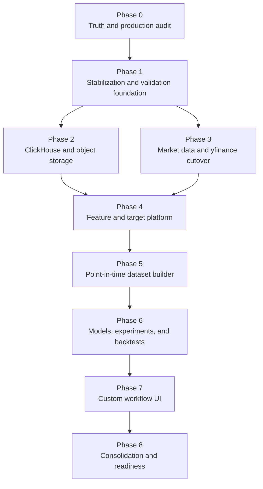

# Research Platform Milestone Execution Plan

**Status:** Proposed delivery plan
**Milestone:** Stable, validated, UI-operated quantitative research platform
**Baseline:** `origin/main` at `afbc5dc` (24 July 2026)
**Primary environment:** Production Ubuntu host
**Related architecture:** `docs/stabilization_validation_workflow_implementation_plan.md`

## 1. Milestone outcome

This milestone is complete when a user can define, run, schedule, inspect, and
compare reproducible research workflows from the UI without using a
data-loading or model-training CLI.

The completed platform must:

1. Fetch daily NSE, TSX, and US equity data through scheduled Dagster pipelines.
2. Use yfinance as the standard daily-equity provider after controlled
   reconciliation and cutover.
3. Explain freshness, missing sessions, retries, quarantine, and coverage for
   every exchange and instrument.
4. Store operational state and canonical daily market data in
   PostgreSQL/TimescaleDB.
5. Store high-volume features, targets, predictions, factor statistics,
   experiment metrics, and backtest series in ClickHouse.
6. Store immutable raw snapshots, training datasets, models, reports, and
   manifests in S3-compatible object storage.
7. Build point-in-time, leakage-safe datasets.
8. Train and evaluate models through Dagster.
9. Report expected return, Sharpe, Sortino, fitness, drawdown, turnover,
   transaction costs, benchmark performance, and fold stability.
10. Provide mobile-friendly UI workflows with complete lineage and run status.

This milestone does not include live order execution or autonomous trading.

## 2. Architecture decisions that apply to every phase

| Concern | Decision |
|---|---|
| Production orchestration | Dagster only |
| Daily-equity provider | yfinance after exchange-specific cutover gates |
| Operational state | PostgreSQL |
| Canonical daily OHLCV | PostgreSQL/TimescaleDB |
| Analytical research data | ClickHouse |
| Immutable datasets and models | S3-compatible object storage |
| Rate limits and short-lived coordination | Redis |
| UI execution | Versioned API request that launches a Dagster run |
| Production CLI | Read-only diagnostics; mutations blocked except audited break-glass |
| Research eligibility | Point-in-time |
| Evaluation | Purged chronological walk-forward |
| Production fallbacks | Fail closed; no mock or local-artifact truth |
| BigQuery | Optional outbound reporting replica, not authoritative |

## 3. Phase controls

### 3.1 Phase status

Every phase is assigned one status:

```text
not_started
in_progress
blocked
validation
complete
```

`complete` requires evidence for every exit criterion. Merged code alone does
not complete a phase.

### 3.2 Evidence package

Each phase produces:

- implementation pull requests;
- migration and rollback notes;
- automated test output;
- production verification output where applicable;
- data-quality or reconciliation reports;
- updated current-state documentation;
- remaining-risk register;
- signed phase exit checklist.

### 3.3 Change rules

- Production inspection is read-only until a change is explicitly scheduled.
- Database changes are backward compatible before application cutover.
- New write paths begin with bounded canaries.
- Existing authoritative data is not deleted during migration.
- Every new production schedule begins disabled.
- Every production activation has a rollback threshold and owner.
- A downstream phase cannot bypass an upstream validation failure.
- Large monoliths are split incrementally, not through a single rewrite.

## 4. Phase dependency map



Phases 2 and 3 may overlap after Phase 1 passes. All other dependencies are
sequential release gates.

---

# Phase 0 — Repository Truth and Production Audit

**Indicative effort:** 3–5 engineering days
**Primary result:** One verified description of the repository and Ubuntu
production deployment

## 0.1 Objective

Remove ambiguity about what is deployed, which pipelines are running, which
providers are active, where every page gets its data, and where CLI/manual
operations remain.

No ClickHouse deployment, provider cutover, broad refactor, or workflow UI work
begins in this phase.

## 0.2 Work packages

### WP0.1 — Canonical current-state document

Create `docs/current_state.md` containing:

- deployed services and network boundaries;
- current production commit and container images;
- authoritative data stores;
- provider used by each exchange and dataset;
- implemented Dagster assets, jobs, schedules, and sensors;
- desired production schedule state;
- UI pages and their real data sources;
- current operational limitations;
- implemented, partial, historical, and proposed capabilities.

### WP0.2 — Documentation classification

Add status metadata to architecture, handoff, deployment, pipeline, feature,
dataset, and UI documents:

```text
Status: Current | Historical | Superseded | Proposed | Partially implemented
Last verified commit:
Owner:
Replaced by:
```

Correct known contradictions involving production Compose, yfinance, Upstox,
artifact-backed APIs, and deployment packaging.

### WP0.3 — Ubuntu production inventory

Collect read-only evidence for:

- running services;
- deployed image digests and Git revision;
- PostgreSQL and Alembic migration state;
- Dagster instance, daemon, jobs, schedules, sensors, and last 30 runs;
- latest expected and stored session for NSE, TSX, and US;
- active-universe and symbols-with-data counts;
- work queue by state, age, attempts, and exchange;
- provider error, throttling, retry, and quarantine evidence;
- relevant feature flags with secrets redacted;
- disk, volume, backup, and restore-test state;
- API, web, Dagster, and database health.

### WP0.4 — Pipeline inventory

Create one matrix with:

- pipeline/job name;
- exchange and dataset;
- provider;
- trigger;
- desired schedule;
- actual schedule state;
- authoritative destination;
- downstream consumers;
- validation gates;
- retry/recovery mechanism;
- freshness objective;
- CLI/manual dependency;
- implementation status.

### WP0.5 — UI data-source inventory

Verify the source used by:

- Dashboard;
- Data;
- Opportunities;
- Research Progress;
- Factors;
- Models;
- Jobs;
- Settings.

Record database queries, local artifact readers, mock fallbacks, freshness
calculation, and failure behavior.

### WP0.6 — Risk-ranked gap report

Classify findings:

- P0: can produce incorrect, stale, or misleading production data;
- P1: prevents scientifically trustworthy research;
- P2: operational or maintainability risk;
- P3: planned improvement.

## 0.3 Repository changes

- `docs/current_state.md`
- documentation status headers;
- pipeline inventory document;
- page/data-source inventory;
- desired schedule manifest proposal;
- no production behavior change.

## 0.4 Production actions

Read-only inspection only. Do not:

- enable or stop a schedule;
- change provider flags;
- retry or cancel work;
- apply migrations;
- delete artifacts;
- restart services.

## 0.5 Validation

- Compare UI freshness with direct database queries.
- Compare repository Dagster definitions with actual instance state.
- Compare deployed images with the recorded Git revision.
- Confirm every active data path has exactly one authoritative destination.
- Confirm every pipeline and page has an owner/status.

## 0.6 Deliverables

1. Canonical current-state document
2. Production audit report
3. Pipeline/provider/schedule inventory
4. UI data-source inventory
5. CLI/manual dependency inventory
6. Documentation corrections
7. Desired-versus-actual schedule report
8. Prioritized remediation backlog
9. Redacted evidence bundle
10. Phase 1 go/no-go recommendation

## 0.7 Exit criteria

- Actual production schedule states are known.
- Active provider and storage path are known for every exchange.
- Latest-session and coverage values are verified from authoritative data.
- Every production CLI/manual dependency is identified.
- Every page has a confirmed source and failure behavior.
- Documentation no longer contradicts deployment reality.
- No unresolved P0 uncertainty remains.

---

# Phase 1 — Stabilization and Validation Foundation

**Indicative effort:** 1–2 weeks
**Primary result:** Invalid code, schemas, schedules, and data fail visibly
before reaching research workflows

## 1.1 Objective

Create the common validation, testing, and operational controls required before
introducing another database or moving research workloads.

## 1.2 Preconditions

- Phase 0 exit checklist is complete.
- P0 findings have owners and remediation decisions.
- Production backup state is understood.
- Authoritative data ownership is documented.

## 1.3 Work packages

### WP1.1 — Unified validation result

Create a shared model used by pipeline stages:

```text
check_id
dataset_id
run_id
scope
severity
status
observed_value
expected_value
message
evidence
created_at
```

Statuses:

```text
passed
warning
failed
skipped_with_reason
```

Hard downstream dependencies accept only `passed`, unless their contract names
a specific safe warning.

### WP1.2 — Data-contract registry

Define contracts for:

- exchange sessions;
- universe snapshots;
- instrument identity and lifecycle;
- daily OHLCV;
- opportunity targets;
- features;
- targets;
- datasets;
- predictions;
- backtests;
- experiment metrics.

Every contract defines its key, schema, units, null policy, freshness,
uniqueness, valid ranges, and compatibility policy.

### WP1.3 — Coverage and freshness semantics

Replace ambiguous full-range percentages with:

```text
valid stored eligible sessions / expected eligible sessions
```

Eligibility must account for:

- listing and delisting;
- exchange sessions;
- point-in-time universe membership;
- provider grace;
- symbol changes;
- evidence-backed suspension or halt;
- requested date range.

Expose both numerator and denominator in APIs.

### WP1.4 — Production CLI guard

- Classify every command as read-only or mutating.
- Mutating commands abort under `APP_ENV=production`.
- Add an audited, explicit break-glass mechanism only if operationally
  necessary.
- Remove mutating CLI commands from production runbooks.
- Ensure Dagster calls package services directly rather than shelling out.

### WP1.5 — CI integration foundation

Add:

- mypy with a ratcheting boundary;
- coverage reporting and threshold;
- PostgreSQL/Timescale service tests;
- Redis integration tests;
- Alembic empty-database upgrade;
- upgrade from supported previous schema;
- Dagster definition-load and asset-contract tests;
- frontend unit tests;
- Playwright desktop and mobile smoke tests;
- dependency, secret, and image scanning.

### WP1.6 — Desired Dagster schedule manifest

Check in environment-specific desired state:

- job and schedule name;
- cron and timezone;
- exchange;
- enabled state;
- freshness SLA;
- upstream dependencies;
- alert owner.

Add a read-only drift checker and API representation.

### WP1.7 — Opportunities regression protection

Protect PR #52 behavior:

- latest complete-session resolution;
- partial-session warnings;
- explicit-date behavior;
- exchange-specific coverage denominator;
- empty-state behavior;
- distribution/filter behavior;
- mobile chart rendering.

## 1.4 Repository changes

Expected modules:

```text
src/trade_research/validation/
src/trade_research/operations/schedule_state.py
src/trade_research/cli_guard.py
tests/integration/
apps/web/src/**/*.test.tsx
apps/web/e2e/
```

Update CI workflows and production runbooks.

## 1.5 Production actions

- Deploy validation and drift checks in observe-only mode.
- Confirm read-only diagnostic behavior.
- Confirm production CLI mutations are rejected.
- Do not alter provider authority yet.

## 1.6 Validation

Test fixtures must prove detection of:

- duplicate candle;
- invalid OHLC ordering;
- negative volume;
- future/non-session row;
- listing-boundary coverage error;
- missing eligible session;
- stale schedule;
- failed upstream asset;
- incompatible schema;
- target included in feature columns;
- partial Opportunities session.

## 1.7 Deliverables

1. Unified validation framework
2. Versioned data contracts
3. Correct coverage/freshness semantics
4. Production CLI mutation guard
5. Desired-schedule manifest and drift report
6. Expanded CI
7. Opportunities regression suite
8. Production observe-only validation report

## 1.8 Exit criteria

- Invalid candles and duplicate keys fail automatically.
- Coverage uses eligible sessions and is explainable per instrument.
- Schedule drift is detected.
- Production mutation through normal CLI commands is blocked.
- PostgreSQL, Redis, migrations, Dagster definitions, API, and critical UI
  paths are exercised in CI.
- Opportunities behavior remains correct.
- Phase 0 P0 findings are resolved or have explicit accepted risk.

---

# Phase 2 — ClickHouse and Object-Storage Foundation

**Indicative effort:** 1–2 weeks
**Primary result:** Durable analytical and immutable artifact planes that can
be safely written, queried, backed up, and restored

## 2.1 Objective

Introduce ClickHouse and S3-compatible object storage without changing the
current production source of truth or UI behavior.

## 2.2 Preconditions

- Phase 1 validation framework passes.
- PostgreSQL remains authoritative for operational state and daily OHLCV.
- Backup and restore ownership is assigned.
- Expected data volume and Ubuntu capacity are measured.

## 2.3 Work packages

### WP2.1 — Capacity and topology design

Measure:

- daily and historical instrument/session counts;
- projected feature count;
- long-table feature-row volume;
- prediction and backtest retention;
- disk, memory, CPU, and I/O headroom;
- backup storage requirements.

Decide whether production ClickHouse runs on the same Ubuntu host for the
milestone or requires separate infrastructure.

### WP2.2 — ClickHouse deployment

- Pin an explicit ClickHouse version.
- Add local and production Compose services.
- Do not expose a public production port.
- Add persistent storage, health checks, resource limits, and logging.
- Create separate migration, Dagster-write, API-read, and analyst-read users.
- Apply query limits and timeouts to read users.

### WP2.3 — Object storage deployment

- Add MinIO or another S3-compatible service locally.
- Configure durable production storage.
- Define buckets/prefixes for raw, datasets, models, experiments, and exports.
- Add encryption, access policies, and lifecycle rules.
- Do not enable deletion policies until restore tests pass.

### WP2.4 — ClickHouse migrations

Create versioned migrations for:

- `ohlcv_daily`;
- `feature_observations_daily`;
- `target_observations_daily`;
- `factor_statistics`;
- `feature_distributions`;
- `predictions_daily`;
- `backtest_returns_daily`;
- `backtest_positions_daily`;
- `experiment_metrics`;
- `data_quality_results`.

### WP2.5 — PostgreSQL control-plane schema

Add:

- feature and target definitions;
- workflow definitions and versions;
- workflow schedules and run requests;
- workflow runs;
- dataset snapshots;
- model versions;
- experiment runs;
- artifact manifests;
- validation runs;
- audit events.

### WP2.6 — Storage adapters

Create bounded interfaces:

```text
ClickHouseFeatureRepository
ClickHouseExperimentRepository
ClickHouseQualityRepository
ObjectArtifactStore
ArtifactManifestRepository
```

The API receives read-only adapters. Dagster receives write adapters.

### WP2.7 — Canary and benchmark

Load a bounded validated OHLCV and feature fixture. Benchmark:

- exchange/date scans;
- percentile distributions;
- feature/target joins;
- factor aggregations;
- dataset extraction;
- concurrent API reads.

Compare long feature observations with a representative wide family table.

## 2.4 Repository changes

```text
clickhouse/migrations/
src/trade_research/storage/clickhouse/
src/trade_research/storage/object_store/
migrations/versions/*_research_control_plane.py
docker-compose.yml
docker-compose.prod.yml
.env.example
.env.prod.example
```

## 2.5 Production actions

1. Deploy services with no application traffic.
2. Apply schema migrations.
3. Verify users and network isolation.
4. Load bounded canary data.
5. Run backup.
6. Restore into an isolated test destination.
7. Remove canary only through the documented cleanup path.

## 2.6 Validation

- Migration from empty database
- Idempotent migration recheck
- Insert/read reconciliation
- Duplicate and retry behavior
- API user cannot write
- Dagster user cannot perform unrestricted administration
- Object digest verification
- Backup and restore verification
- Resource-limit behavior
- Query timeout behavior

## 2.7 Deliverables

1. ClickHouse deployment and migrations
2. Object-storage deployment and prefix policy
3. PostgreSQL control-plane schema
4. Python storage adapters
5. Security/access matrix
6. Capacity and benchmark report
7. Backup and restore evidence
8. Operational runbook

## 2.8 Exit criteria

- A canary dataset is written and reconciled exactly.
- Read-only users cannot mutate data.
- Required migrations pass in CI and production.
- Object artifacts retain valid SHA-256 manifests.
- ClickHouse and object storage can be restored.
- Resource use is acceptable for the Ubuntu environment.
- No current API or pipeline depends on ClickHouse to stay operational yet.

---

# Phase 3 — Market Data Stabilization and yfinance Cutover

**Indicative effort:** 1–2 implementation weeks plus observation window
**Primary result:** Scheduled, measurable, recoverable daily market data for all
three exchanges

## 3.1 Objective

Make yfinance the controlled standard provider for NSE, TSX, and US daily
equities while preserving correctness and rollback.

## 3.2 Preconditions

- Phases 0 and 1 are complete.
- ClickHouse Phase 2 may still be completing, but PostgreSQL validation must be
  available.
- Current provider state is verified from production.
- Exchange calendars and listing lifecycle are available.

## 3.3 Work packages

### WP3.1 — Provider-independent ingestion contract

Standardize provider output:

```text
instrument_id
provider_symbol
exchange
session_date
open
high
low
close
volume
currency
provider
provider_timestamp
request_id
raw_artifact_id
adapter_version
```

Provider code cannot write trusted canonical rows until validation passes.

### WP3.2 — Immutable raw snapshots

Retain raw yfinance responses or normalized request-response snapshots in
object storage with:

- request parameters;
- provider symbol;
- retrieval time;
- adapter version;
- response digest;
- HTTP/provider error evidence;
- linked work item.

### WP3.3 — Durable planner and worker validation

Verify:

- completed-session boundaries;
- exchange-specific grace;
- idempotent work generation;
- lease and heartbeat behavior;
- stale-work recovery;
- bounded retries;
- quarantine rules;
- attempt history;
- rate limits shared across workers;
- success only when requested sessions are actually present.

### WP3.4 — NSE shadow reconciliation

Compare yfinance with the current NSE authoritative source for at least 20
completed sessions and a representative universe:

- symbol mapping;
- row/session overlap;
- OHLCV tolerance;
- split/dividend behavior;
- adjusted versus unadjusted semantics;
- freshness;
- listing boundary;
- missing and repeated rows.

### WP3.5 — Exchange canaries

For NSE, TSX, and US:

1. bounded universe;
2. bounded history;
3. validation and reconciliation;
4. opportunity-target refresh;
5. coverage/freshness verification;
6. automatic rollback thresholds.

### WP3.6 — Staged cutover

Expand:

```text
canary -> limited percentage -> full exchange shadow -> primary
```

NSE cutover retains Upstox comparison reads for a defined observation window.
After successful completion, remove Upstox from scheduled production fetching.

### WP3.7 — ClickHouse validated OHLCV replica

After PostgreSQL canonical commit:

- replicate only validated rows;
- record source PostgreSQL watermark and run ID;
- reconcile row counts and key digests;
- expose replication lag;
- never allow ClickHouse to overwrite PostgreSQL.

## 3.4 Repository changes

Expected work:

```text
src/trade_research/providers/contracts.py
src/trade_research/pipelines/yfinance_*.py
src/trade_research/dagster/market_data_assets.py
src/trade_research/validation/market_data.py
src/trade_research/storage/object_store/raw_snapshots.py
src/trade_research/storage/clickhouse/market_data.py
```

Split new Dagster definitions by domain rather than growing
`daily_assets.py`.

## 3.5 Production actions

- Enable only approved canary schedules.
- Observe provider and queue health.
- Expand after each signed reconciliation gate.
- Keep rollback flags ready.
- Do not remove legacy data or credentials until the observation window ends.

## 3.6 Validation

Per exchange:

- latest completed session;
- expected versus stored eligible sessions;
- active universe versus symbols with data;
- unexplained missing sessions;
- OHLC correctness;
- duplicates;
- provider comparison;
- retry/exhaustion rate;
- quarantine count and cause;
- ClickHouse replication equality;
- Opportunity target readiness.

## 3.7 Deliverables

1. Provider-independent candle contract
2. Raw snapshot retention
3. Planner/worker correctness report
4. NSE reconciliation report
5. Three exchange canary reports
6. Staged cutover and rollback runbook
7. Validated ClickHouse OHLCV replica
8. Production freshness dashboard
9. Upstox retirement decision

## 3.8 Exit criteria

- Dagster schedules successfully maintain all exchanges.
- yfinance is primary where its cutover gate passed.
- Every missing session has an explainable quality state.
- Queue retries and quarantine are bounded and visible.
- Latest-session UI values agree with PostgreSQL.
- ClickHouse replica reconciles with canonical validated rows.
- No normal daily load requires CLI execution.
- Rollback has been rehearsed.

---

# Phase 4 — Feature and Target Platform

**Indicative effort:** 2–3 weeks
**Primary result:** Versioned, validated features and targets materialized by
Dagster and queried from ClickHouse

## 4.1 Objective

Replace production-local feature/target artifacts as the UI source of truth
with registered definitions, ClickHouse observations, and complete lineage.

## 4.2 Preconditions

- Phase 2 ClickHouse foundation is complete.
- Phase 3 market-data validation is complete for the first rollout exchange.
- Canonical sessions and point-in-time instruments are available.
- Existing v1 feature/target results are preserved as comparison fixtures.

## 4.3 Work packages

### WP4.1 — Feature registry

Each feature records:

- stable ID and version;
- family, value type, and unit;
- implementation reference;
- parameters and safe bounds;
- source/dependency list;
- lookback;
- availability timing;
- null and warmup rules;
- supported exchanges/frequencies;
- validation fixtures;
- status and owner.

### WP4.2 — Target registry

Each target records:

- prediction horizon;
- calculation and unit;
- time of availability;
- classification/ranking derivations;
- valid universe;
- terminal-session behavior;
- version and validation fixtures.

### WP4.3 — Dagster assets

Create assets for:

- feature definition validation;
- feature materialization;
- target materialization;
- feature/target key reconciliation;
- factor statistics;
- feature distributions;
- quality summaries.

Partition by bounded exchange/date/definition ranges. Use run tags and
idempotent writes.

### WP4.4 — ClickHouse feature storage

Start with long observations:

```text
definition_id
definition_version
instrument_id
exchange
session_date
value
quality_status
run_id
materialized_at
```

Benchmark before full backfill. Add wide family materializations only if the
measured extraction/query workload requires them.

### WP4.5 — Reproduce existing features

Materialize the current audited technical feature set and forward targets.
Compare:

- key counts;
- null/warmup counts;
- min/max/percentiles;
- symbol/date coverage;
- numerical values within declared tolerance;
- factor statistics.

### WP4.6 — Factors APIs

Add ClickHouse-backed APIs for:

- definitions;
- distributions;
- percentile bands;
- IC/rank IC;
- quantile returns;
- hit rates;
- monthly/regime stability;
- correlation;
- quality and missingness;
- feature drilldown.

### WP4.7 — Factors UI

Provide:

- multi-feature selection;
- interactive distributions;
- percentile filters;
- target and universe filters;
- date ranges;
- stability views;
- combined comparisons;
- saved feature sets;
- responsive/mobile full-screen charts.

The page must not read local research CSV/JSON/Parquet files in production.

## 4.4 Repository changes

```text
src/trade_research/features/registry.py
src/trade_research/targets/registry.py
src/trade_research/dagster/feature_assets.py
src/trade_research/storage/clickhouse/features.py
src/trade_research/api/routers/features.py
apps/web/src/pages/FactorResearchPage.tsx
```

Extract relevant routes from `api/app.py` using contract tests.

## 4.5 Production actions

1. Materialize a bounded feature family.
2. Reconcile with existing v1 artifacts.
3. Backfill one exchange.
4. Enable Factors API shadow comparison.
5. Switch Factors UI after parity passes.
6. Retain artifact reads only as temporary diagnostic comparison.

## 4.6 Validation

- deterministic recomputation;
- future-dependency detection;
- availability timestamp;
- warmup/null policy;
- duplicate keys;
- invalid numeric values;
- same-session cross-sectional universe;
- source/derived row reconciliation;
- percentile/distribution consistency;
- API query limits;
- mobile chart behavior.

## 4.7 Deliverables

1. Feature and target registries
2. Dagster materialization assets
3. ClickHouse observation/statistic tables
4. v1 parity report
5. Feature validation suite
6. Factors API
7. Interactive Factors UI
8. Artifact-reader retirement plan

## 4.8 Exit criteria

- Current v1 features reproduce within tolerance.
- Features and targets have complete lineage.
- Factor results are queryable from ClickHouse.
- Production Factors page has no local artifact dependency.
- Invalid/leaking features cannot become active.
- Feature materialization is scheduled or workflow-triggered through Dagster.

---

# Phase 5 — Point-in-Time Dataset Builder

**Indicative effort:** 2–3 weeks
**Primary result:** Immutable, reproducible, leakage-safe training datasets

## 5.1 Objective

Replace the static full-history universe assumption with point-in-time dataset
construction and make datasets configurable from validated UI/API
specifications.

## 5.2 Preconditions

- Phase 4 active features and targets are available.
- Point-in-time instrument and universe history exists.
- Object storage and artifact manifests are operational.
- Split strategies and leakage rules are documented.

## 5.3 Work packages

### WP5.1 — Universe definition registry

Support versioned rules for:

- exchange;
- point-in-time membership;
- minimum listing age;
- liquidity;
- price;
- coverage;
- sector/industry;
- include/exclude lists;
- quality state.

Every rule must specify when its input became known.

### WP5.2 — Dataset specification

The specification selects:

- universe version;
- feature versions;
- target version;
- date range;
- eligibility filters;
- missing-value policy;
- split strategy;
- train/validation/test sizes;
- purge and embargo;
- sampling limits.

### WP5.3 — Dataset preview

Before launching full materialization, return:

- estimated rows and instruments;
- date range;
- feature count;
- expected exclusions;
- lookback/warmup loss;
- class balance or target distribution;
- approximate compute/storage cost;
- validation warnings.

### WP5.4 — Point-in-time materialization

For each session:

- resolve eligible instruments using only information known then;
- select available feature versions;
- attach targets without exposing them as inputs;
- record exclusion reasons;
- assign chronological fold metadata;
- stream bounded Arrow blocks from ClickHouse;
- write wide Parquet shards to object storage.

### WP5.5 — Leakage validation

Hard checks:

- target and label columns absent from feature list;
- feature timestamp not after decision timestamp;
- training labels known before validation/test prediction time;
- chronological folds;
- purge and embargo enforced;
- no preprocessing fit outside the training fold;
- no future universe membership;
- no duplicate dataset keys.

### WP5.6 — Artifact manifest and reproducibility

Register:

- schema fingerprint;
- object digests;
- row/instrument/date counts;
- feature/target/universe versions;
- source ClickHouse watermarks;
- code/config digests;
- exclusion summaries;
- validation result.

### WP5.7 — Dataset UI

Provide:

- universe selection;
- feature-set selection;
- target and horizon;
- point-in-time filters;
- split controls;
- preview;
- validation messages;
- materialize action;
- dataset history and lineage.

## 5.4 Repository changes

```text
src/trade_research/datasets/
src/trade_research/dagster/dataset_assets.py
src/trade_research/api/routers/datasets.py
src/trade_research/storage/object_store/datasets.py
apps/web/src/pages/DatasetsPage.tsx
```

The existing `ml_dataset_v1` remains a comparison fixture until cutover.

## 5.5 Production actions

- Build a bounded point-in-time NSE dataset.
- Reconcile with v1 and explain differences.
- Repeat materialization to verify digest stability.
- Test failure/retry without duplicate artifacts.
- Expand only after leakage review.

## 5.6 Validation

- point-in-time membership fixtures;
- delisted/new listing cases;
- symbol change and corporate action cases;
- fold boundary and embargo tests;
- dataset digest reproducibility;
- excluded-row accounting;
- feature/target key reconciliation;
- object manifest verification;
- bounded memory use.

## 5.7 Deliverables

1. Universe registry
2. Dataset specification contract
3. Preview API
4. Point-in-time dataset Dagster asset
5. Immutable Parquet snapshot format
6. Leakage suite
7. Dataset lineage API
8. Dataset builder UI
9. v1 comparison report

## 5.8 Exit criteria

- Repeated identical specifications produce identical dataset digests.
- Every row has point-in-time eligibility evidence.
- Leakage tests pass.
- Splits are chronological and purged as configured.
- Dataset artifacts are immutable and restorable.
- Static full-history eligibility is not the production default.
- Dataset creation requires no CLI.

---

# Phase 6 — Model, Experiment, and Backtest Pipelines

**Indicative effort:** 2–4 weeks
**Primary result:** Reproducible model experiments with trustworthy
out-of-sample metrics

## 6.1 Objective

Turn existing baseline, LightGBM, walk-forward, prediction, and backtest code
into registered Dagster stages using immutable datasets and durable result
stores.

## 6.2 Preconditions

- Phase 5 dataset snapshots pass.
- Object storage supports model artifacts.
- ClickHouse experiment tables are ready.
- Baseline definitions and promotion criteria are approved.

## 6.3 Work packages

### WP6.1 — Model plugin registry

Initial plugins:

- naive mean baseline;
- momentum/ranking baselines;
- linear/ridge regression;
- LightGBM regression;
- LightGBM classification.

Each plugin declares:

- supported target types;
- typed hyperparameter schema;
- safe bounds;
- deterministic seed behavior;
- resource estimate;
- serialization format;
- prediction interface;
- explainability outputs;
- dependency versions.

### WP6.2 — Experiment specification

Bind:

- immutable dataset snapshot;
- model plugin and parameters;
- random seed;
- retraining cadence;
- portfolio construction;
- benchmark;
- transaction costs;
- slippage;
- evaluation metrics;
- fitness formula version.

### WP6.3 — Dagster model graph

```text
dataset_validation
  -> fold_preparation
  -> preprocessing_fit
  -> model_training
  -> prediction
  -> portfolio_construction
  -> transaction_cost_and_slippage
  -> backtest
  -> experiment_metrics
  -> experiment_validation
  -> model_registration
```

Parallelize bounded folds/models through Dagster concurrency pools.

### WP6.4 — Artifact persistence

Object storage:

- model binary;
- preprocessing pipeline;
- feature list;
- training manifest;
- explainability outputs;
- report and plots.

PostgreSQL:

- experiment and model lifecycle;
- artifact references;
- lineage;
- validation state;
- promotion status.

ClickHouse:

- predictions;
- positions;
- daily gross/net returns;
- benchmark series;
- fold metrics;
- aggregate metrics;
- quality results.

### WP6.5 — Metric implementation

Required metrics:

- expected and realized return;
- Pearson IC and rank IC;
- hit rate;
- classification metrics when applicable;
- annualized return and volatility;
- Sharpe and Sortino;
- maximum drawdown;
- Calmar;
- turnover;
- transaction costs and slippage;
- gross/net exposure;
- benchmark excess return;
- capacity/liquidity;
- stability by fold, regime, sector, and liquidity bucket.

### WP6.6 — Fitness contract

Define a named formula such as:

```text
fitness_v1 =
    robust_net_sharpe
  - drawdown_penalty
  - turnover_penalty
  - fold_instability_penalty
```

Persist the formula and coefficients. The UI displays the definition alongside
the score.

### WP6.7 — Baseline and reproducibility gates

- Compare every trained model with declared simple baselines.
- Repeat selected runs from manifests.
- Verify same dataset/code/config/seed produces matching outputs within
  tolerance.
- Prohibit promotion when results depend on one fold or a few instruments.

### WP6.8 — Models API and UI

Replace local artifact readers with:

- experiment list and filters;
- metric comparison;
- equity and drawdown curves;
- fold/regime stability;
- feature importance;
- prediction distributions;
- dataset/model lineage;
- artifact manifest;
- promotion state.

## 6.4 Repository changes

```text
src/trade_research/models/registry.py
src/trade_research/experiments/
src/trade_research/dagster/experiment_assets.py
src/trade_research/storage/clickhouse/experiments.py
src/trade_research/api/routers/experiments.py
src/trade_research/api/routers/models.py
apps/web/src/pages/MLResearchPage.tsx
```

Migrate existing modeling functions behind plugin and pipeline interfaces.

## 6.5 Production actions

- Run baselines on one approved point-in-time dataset.
- Run bounded LightGBM experiments.
- Verify resource quotas and cancellation.
- Reproduce one experiment from its manifest.
- Enable Models API shadow comparison.
- Cut the Models UI to durable stores after parity.

## 6.6 Validation

- plugin schema validation;
- deterministic seeds;
- training-only preprocessing;
- fold isolation;
- cost/slippage calculations;
- benchmark alignment;
- prediction-to-realization alignment;
- metric formula fixtures;
- model artifact digest;
- cancellation and retry;
- resource-limit enforcement;
- no local artifact dependency in production API.

## 6.7 Deliverables

1. Model plugin registry
2. Experiment specification
3. Dagster experiment graph
4. Model/object manifests
5. ClickHouse predictions and backtests
6. Metric and fitness library
7. Baseline comparison report
8. Reproducibility report
9. Durable Models API/UI
10. Model promotion rules

## 6.8 Exit criteria

- Baseline and LightGBM runs execute through Dagster.
- Training uses immutable point-in-time datasets.
- Metrics include costs and out-of-sample fold evidence.
- A completed experiment is reproducible from its manifest.
- Models page has no production-local artifact dependency.
- Expected return, Sharpe, fitness, drawdown, turnover, and stability are
  traceable to source runs.
- Research promotion fails closed when validation fails.

---

# Phase 7 — Custom Workflow Builder and Scheduling

**Indicative effort:** 3–5 weeks
**Primary result:** Users compose and schedule multiple research workflows from
the UI

## 7.1 Objective

Provide a safe, versioned, mobile-friendly control plane for composing feature,
dataset, model, and evaluation stages without generating code or using CLI
commands.

## 7.2 Preconditions

- Phases 4–6 expose stable registries and APIs.
- Dagster jobs accept immutable workflow/run specifications.
- Resource limits and cancellation work.
- Authorization and audit requirements are approved.

## 7.3 Work packages

### WP7.1 — Workflow specification and versioning

Support:

- workflow identity;
- immutable versions;
- clone/fork;
- draft validation;
- activate/deactivate;
- archive;
- change summary;
- dependency compatibility check.

Editing a workflow creates a version. Existing runs retain their original
version.

### WP7.2 — Generic Dagster workflow job

The UI does not create Python or Dagster source code.

Implement:

- generic `research_workflow_job`;
- `workflow_version_id` run configuration;
- registry resolution;
- dynamic bounded partitions;
- idempotent run requests;
- workflow/run tags;
- concurrency pools;
- cancellation and retry.

### WP7.3 — Schedule dispatcher

A Dagster sensor/dispatcher:

- reads due enabled schedules from PostgreSQL;
- claims a lease;
- creates one idempotent run request;
- launches the generic job;
- records Dagster run ID;
- advances next due time;
- reports drift and failure.

### WP7.4 — Workflow builder UX

Steps:

1. Name and exchange
2. Universe
3. Features
4. Target
5. Dataset period and eligibility
6. Split strategy
7. Model and parameters
8. Portfolio, costs, and benchmark
9. Review and resource estimate
10. Save, run, or schedule

Users can select one, several, or all compatible features.

### WP7.5 — Preview and validation

Before saving/running, show:

- incompatible selections;
- required lookback;
- expected date/instrument/row counts;
- missingness and exclusion estimate;
- target distribution;
- approximate runtime/storage;
- resource quota;
- warnings and blocking failures.

### WP7.6 — Run monitoring

Show:

- queued/running/succeeded/failed/cancelled;
- current stage;
- start time and duration;
- Dagster run ID;
- validation results;
- logs with secret redaction;
- produced artifacts;
- retry relation;
- lineage graph.

### WP7.7 — Experiment comparison

Allow selection of multiple experiments and compare:

- expected return;
- Sharpe/Sortino;
- fitness;
- drawdown;
- turnover and costs;
- fold stability;
- benchmark excess;
- feature set;
- dataset and model versions.

### WP7.8 — Mobile experience

- Single-column wizard
- Sticky review/run status
- Searchable feature list
- Compact selected-feature chips
- Touch-friendly percentile/range filters
- Full-screen focused charts
- No hover-only controls
- Responsive experiment comparison
- State preserved between steps
- Virtualized large lists
- Accessible keyboard and screen-reader behavior

### WP7.9 — Authorization and audit

Roles:

- viewer;
- researcher;
- workflow operator;
- administrator.

Audit:

- workflow creation/version;
- schedule change;
- run/cancel/retry;
- model promotion;
- break-glass use.

## 7.4 Repository changes

```text
src/trade_research/workflows/
src/trade_research/dagster/workflow_job.py
src/trade_research/dagster/workflow_sensor.py
src/trade_research/api/routers/workflows.py
src/trade_research/api/services/dagster_launcher.py
apps/web/src/pages/WorkflowBuilderPage.tsx
apps/web/src/pages/WorkflowRunPage.tsx
apps/web/src/pages/ExperimentComparePage.tsx
```

## 7.5 Production actions

- Enable workflow launches for administrators first.
- Apply strict concurrency/resource quotas.
- Run one bounded workflow per exchange.
- Verify cancellation and retry.
- Enable researcher role after audit review.
- Enable custom schedules last.

## 7.6 Validation

- immutable version behavior;
- schema and compatibility validation;
- launch idempotency;
- duplicate dispatcher prevention;
- schedule timezone/DST behavior;
- authorization;
- cancellation;
- retry lineage;
- quota enforcement;
- mobile viewport tests;
- accessibility;
- no direct shell/provider execution from API or UI.

## 7.7 Deliverables

1. Workflow versioning APIs
2. Generic Dagster workflow job
3. Schedule dispatcher
4. Workflow builder UI
5. Run-monitoring UI
6. Experiment comparison
7. Mobile and accessibility suite
8. Authorization/audit controls
9. Operator runbook

## 7.8 Exit criteria

- Users can create multiple independent workflows from the UI.
- Each workflow can select any compatible number of features.
- Save, run, cancel, retry, schedule, and compare operations work.
- All execution occurs in Dagster.
- Runs are idempotent, bounded, authorized, and observable.
- Mobile workflows are fully usable.
- No normal operation requires a mutation CLI.

---

# Phase 8 — Consolidation, Cleanup, and Research-Readiness Review

**Indicative effort:** 1–2 weeks plus remediation
**Primary result:** Obsolete paths are removed and the milestone receives a
formal readiness decision

## 8.1 Objective

Remove temporary compatibility paths, reduce architectural risk, prove
operational recovery, and decide whether the platform satisfies
`serious_research_ready`.

## 8.2 Preconditions

- Phases 0–7 pass their exit gates.
- At least one complete production workflow has run through the new path.
- Durable stores contain reconciled production evidence.
- Users have completed acceptance testing.

## 8.3 Work packages

### WP8.1 — Legacy path removal

Remove or disable:

- production local-artifact readers;
- production feature/model mutation CLI paths;
- retired Upstox scheduled fetch paths after observation approval;
- stale feature flags;
- unused mock fallbacks;
- obsolete documentation and runbooks.

Deletion requires proof that no active consumer remains.

### WP8.2 — Incremental module extraction

Extract domains from:

- `api/app.py`;
- `storage/timescale.py`;
- broad `Settings`;
- oversized Dagster definition modules.

Keep compatibility facades while callers migrate. Remove facades only after
contract tests prove full cutover.

### WP8.3 — Load and resilience testing

Test:

- concurrent workflow submissions;
- large feature selections;
- long date ranges;
- ClickHouse read load;
- Dagster worker failure;
- Redis interruption;
- provider throttling;
- object-store failure;
- PostgreSQL fail/recovery behavior;
- retry storms;
- disk pressure;
- API query cancellation.

### WP8.4 — Backup and disaster recovery

Demonstrate restoration of:

- PostgreSQL control plane;
- canonical OHLCV;
- ClickHouse analytical tables;
- object manifests and artifacts;
- Dagster instance metadata.

Record recovery time and recovery point.

### WP8.5 — Security review

Verify:

- trusted proxy header stripping/injection;
- direct-container access restrictions;
- least-privilege database/object users;
- secret storage;
- admin audit events;
- rate limits;
- dependency/container findings;
- log redaction.

### WP8.6 — Research-validity review

Verify:

- point-in-time universe;
- corporate-action treatment;
- raw snapshot retention;
- complete lineage;
- leakage controls;
- walk-forward evaluation;
- costs and slippage;
- benchmarks;
- turnover/capacity;
- fold/regime stability;
- reproducibility.

### WP8.7 — Documentation freeze

Update:

- current state;
- architecture;
- deployment;
- operator runbooks;
- user workflow guide;
- incident and recovery guides;
- data contracts;
- model promotion policy.

## 8.4 Repository changes

This phase is primarily deletion, extraction, hardening, and documentation.
Every removal is isolated and reversible.

## 8.5 Production actions

- Run recovery exercises in isolated destinations.
- Conduct controlled failure tests.
- Observe at least one normal production cycle after cleanup.
- Freeze additional feature expansion during readiness review.

## 8.6 Validation

- no production local-artifact reads;
- no obsolete scheduled provider fetch;
- no undocumented service or data owner;
- restore completes successfully;
- load stays within resource limits;
- alerts fire during injected failures;
- full workflow reproducibility;
- security checklist;
- user acceptance at desktop and mobile widths.

## 8.7 Deliverables

1. Legacy-removal report
2. Modularization changes
3. Load/resilience report
4. Backup/restore evidence
5. Security assessment
6. Research-validity report
7. Final current-state documentation
8. Serious-research-readiness decision
9. Remaining-risk register
10. Paper-trading recommendation

## 8.8 Exit criteria

- Normal production operation has no mutation CLI dependency.
- Factors and Models have no local-artifact dependency.
- Every authoritative store has a tested restore procedure.
- Critical load and failure scenarios pass.
- No unresolved critical security issue remains.
- All serious-research-readiness criteria pass.
- Remaining exceptions have an owner, expiry, and explicit risk acceptance.

---

# 5. Milestone-wide acceptance criteria

The milestone is complete only when all conditions below pass.

## 5.1 Operational

- NSE, TSX, and US daily data are scheduled through Dagster.
- Desired and actual schedule states match.
- Latest eligible sessions are fresh.
- Queue depth, retries, quarantine, and failures are observable.
- No normal production data load uses CLI.

## 5.2 Data quality

- Coverage uses eligible sessions.
- Invalid and suspicious candles are separated.
- Unexplained gaps are below approved thresholds.
- Provider and database row counts reconcile.
- Corporate actions and instrument lifecycle are represented.

## 5.3 Research validity

- Point-in-time universes replace static future-aware eligibility.
- Feature availability is explicit.
- Leakage tests pass.
- Walk-forward splits are chronological, purged, and embargoed as configured.
- Costs, slippage, benchmarks, turnover, drawdown, and capacity are reported.

## 5.4 Reproducibility

- Dataset snapshots are immutable and digest-addressed.
- Model artifacts have manifests.
- Run inputs include code, configuration, universe, calendar, provider, feature,
  and target versions.
- Selected experiments reproduce within tolerance.

## 5.5 Product

- Feature, dataset, model, and workflow creation are available through UI/API.
- Multiple workflows can be saved and scheduled.
- Experiment results are interactive and comparable.
- Mobile operation is complete.
- Empty, stale, partial, loading, failed, and unauthorized states are explicit.

## 5.6 Platform

- PostgreSQL, ClickHouse, object storage, Redis, and Dagster have clear
  ownership boundaries.
- Production queries fail closed rather than returning mock/local data.
- CI includes relevant integration, migration, frontend, browser, and security
  gates.
- Backups and restores are proven.

# 6. Recommended pull-request sequence

| PR | Scope | Phase |
|---:|---|---:|
| 1 | Current-state, documentation status, inventories | 0 |
| 2 | Validation result model and data contracts | 1 |
| 3 | Production CLI guard and schedule manifest | 1 |
| 4 | Integration CI and Opportunities regressions | 1 |
| 5 | ClickHouse/Object storage Compose foundation | 2 |
| 6 | ClickHouse migrations and storage adapters | 2 |
| 7 | PostgreSQL research control-plane schema | 2 |
| 8 | Validated OHLCV ClickHouse canary | 2/3 |
| 9 | yfinance reconciliation and schedule hardening | 3 |
| 10 | Staged exchange cutover | 3 |
| 11 | Feature/target registries | 4 |
| 12 | Feature Dagster assets and ClickHouse materialization | 4 |
| 13 | Factors API/UI cutover | 4 |
| 14 | Point-in-time universe and dataset engine | 5 |
| 15 | Dataset preview/API/UI | 5 |
| 16 | Model plugins and Dagster experiment graph | 6 |
| 17 | ClickHouse experiment results and object manifests | 6 |
| 18 | Models API/UI cutover | 6 |
| 19 | Workflow versioning and generic Dagster job | 7 |
| 20 | Dispatcher, scheduling, and authorization | 7 |
| 21 | Mobile workflow builder and comparison UI | 7 |
| 22 | Legacy cleanup and module extraction | 8 |
| 23 | Resilience, restore, security, and readiness evidence | 8 |

# 7. Milestone progress register

Maintain this table in the document or a linked tracking issue:

| Phase | Status | Owner | Started | Target | Exit evidence |
|---|---|---|---|---|---|
| Phase 0 | not_started |  |  |  |  |
| Phase 1 | not_started |  |  |  |  |
| Phase 2 | not_started |  |  |  |  |
| Phase 3 | not_started |  |  |  |  |
| Phase 4 | not_started |  |  |  |  |
| Phase 5 | not_started |  |  |  |  |
| Phase 6 | not_started |  |  |  |  |
| Phase 7 | not_started |  |  |  |  |
| Phase 8 | not_started |  |  |  |  |

# 8. Immediate next action

Begin Phase 0 with one documentation-and-inventory pull request. That pull
request must not change production behavior.

The first production interaction is a read-only Ubuntu audit. Its results
determine the Phase 1 remediation order and whether any urgent production-data
fix must interrupt the planned sequence.
