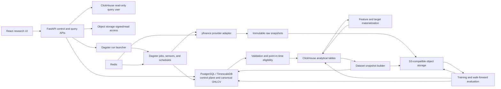

# Trade Research Platform Stabilization, Validation, and Workflow Implementation Plan

**Status:** Proposed implementation contract
**Baseline:** `origin/main` at `afbc5dc` (merged Opportunities hardening, 24 July 2026)
**Primary deployment:** Production Ubuntu host
**Scope:** NSE, TSX, and US daily equities; yfinance ingestion; Dagster orchestration;
ClickHouse research analytics; feature, dataset, model, and experiment workflows
**Out of scope until the release gates in this plan pass:** Live order execution,
autonomous trading, new geographic markets, and additional market-data providers

## 1. Executive decision

The repository will be stabilized before it is expanded into a user-configurable
research workflow platform.

The target operating model is:

1. **yfinance is the standard daily-equity market-data provider** for NSE, TSX,
   and US workflows. Existing Upstox paths remain only during a measured
   reconciliation and cutover period.
2. **Dagster is the only production execution and scheduling plane** for data
   ingestion, validation, feature computation, dataset creation, training,
   prediction, and backtesting.
3. **PostgreSQL/TimescaleDB is the transactional control plane and authoritative
   operational market-data store.**
4. **ClickHouse is the analytical research plane** for large feature, target,
   prediction, quality, factor, and backtest datasets.
5. **S3-compatible object storage is the immutable artifact plane** for raw
   provider snapshots, training dataset snapshots, model binaries, plots,
   reports, and manifests.
6. **Redis is used only for distributed rate limits, short-lived coordination,
   and cache/lock use cases.**
7. **The UI creates versioned workflow specifications and requests Dagster
   runs.** It never executes Python, shell commands, provider calls, or training
   processes directly.
8. **CLI mutation is removed from production operations.** Read-only diagnostic
   commands may remain. Development wrappers may call the same application
   services as Dagster, but production runbooks and UI actions must launch
   audited Dagster runs.

This plan treats the recently hardened Opportunities page as an existing,
deployed slice. It does not reopen that implementation unless production
validation identifies a regression.

## 2. Why ClickHouse is being added

ClickHouse is appropriate for research workloads that scan and aggregate large
numbers of observations:

- feature distributions and percentiles;
- feature/target joins;
- cross-sectional ranks;
- factor IC and quantile studies;
- prediction history;
- backtest return series;
- experiment comparisons;
- interactive filtering in Factors and Models pages;
- aggregated data-quality reporting.

ClickHouse is not the right system for every responsibility.

| Responsibility | Authoritative system | Reason |
|---|---|---|
| Provider work queue, retries, leases, and status | PostgreSQL | Transactional updates and row locking |
| Universe snapshots and listing lifecycle | PostgreSQL | Point-in-time operational truth |
| Canonical raw/validated OHLCV | PostgreSQL/TimescaleDB | Existing durable ingestion and consistency path |
| Feature and target observations | ClickHouse | High-volume analytical scans |
| Factor statistics and distributions | ClickHouse | Fast grouping, percentiles, and filtering |
| Workflow definitions, versions, schedules, and runs | PostgreSQL | Transactional control plane |
| Dataset and experiment registry metadata | PostgreSQL | Auditable state transitions |
| Immutable training datasets | Object storage as Parquet | Reproducible, portable training inputs |
| Model binaries and preprocessors | Object storage | Binary artifact versioning |
| Predictions, backtest series, and experiment metrics | ClickHouse | Interactive comparison and time-series analysis |
| Artifact digests, locations, and lineage | PostgreSQL | Referential integrity and auditability |
| Provider throttling and short locks | Redis | Distributed, expiring coordination |
| Optional external BI exports | BigQuery | Reporting replica only, never an additional source of truth |

ClickHouse must therefore be introduced as a bounded analytical plane, not as
a replacement for PostgreSQL or object storage.

## 3. Current-state findings

The implementation starts from these verified repository facts:

- All Dagster schedules in `src/trade_research/dagster/definitions.py` default
  to `STOPPED`. Repository configuration does not prove that the production
  Ubuntu schedules are enabled or healthy.
- The daily yfinance planner and worker exist and use durable PostgreSQL work,
  but actual production freshness and completion require an Ubuntu audit.
- Factors and Models APIs still read generated CSV, JSON, and Parquet files
  from local `data/` directories.
- Feature, target, ML dataset, baseline, LightGBM, and backtest package
  functions exist, but they are not yet a complete, configurable, durable
  Dagster workflow system.
- The initial ML dataset uses a static full-history coverage universe and
  explicitly acknowledges point-in-time bias.
- `api/app.py` and `storage/timescale.py` have become oversized cross-domain
  modules.
- CI runs Ruff, Pytest, frontend lint/build, production Compose validation, and
  Docker build checks, but lacks several integration and research-validity
  gates.
- Several current and historical documents contradict the deployed code,
  particularly around yfinance and production packaging.
- The Opportunities page was hardened in PR #52 and should now be protected by
  regression tests rather than redesigned again.

These are implementation inputs, not assumptions that the production
deployment is healthy.

## 4. Target architecture



### 4.1 Data ownership rules

Every dataset must have exactly one authoritative owner:

- PostgreSQL owns operational state and canonical daily candles.
- ClickHouse owns derived analytical observations and query-ready results.
- Object storage owns immutable input/output artifacts.
- BigQuery, if retained, is an outbound reporting replica.
- Local container files are caches or developer fixtures, never production
  truth.

An API response must identify its source, data version, last successful
materialization, and freshness state. It must not silently fall back to mock or
stale local data in production.

### 4.2 Production write paths

Only Dagster code locations receive write credentials for ClickHouse research
tables and object storage artifact prefixes. The API receives:

- PostgreSQL control-plane permissions appropriate to workflow creation and
  launch requests;
- read-only ClickHouse credentials;
- read-only or signed object-storage access;
- no provider token capable of bypassing Dagster;
- no ClickHouse DDL permission.

## 5. Required platform contracts

### 5.1 Workflow specification

A workflow is an immutable, versioned JSON document. Editing creates a new
version; it never changes the specification of a completed run.

Minimum fields:

```json
{
  "workflow_id": "uuid",
  "version": 3,
  "name": "NSE momentum and recovery experiment",
  "exchange": "NSE",
  "universe_definition_id": "uuid",
  "as_of_policy": "point_in_time",
  "feature_definition_ids": ["uuid", "uuid"],
  "target_definition_ids": ["uuid"],
  "dataset": {
    "start_date": "2020-01-01",
    "end_date": "2026-06-30",
    "minimum_listing_sessions": 252,
    "minimum_coverage": 0.98,
    "filters": []
  },
  "split": {
    "strategy": "purged_walk_forward",
    "minimum_train_sessions": 504,
    "validation_sessions": 63,
    "test_sessions": 21,
    "embargo_sessions": 1
  },
  "model": {
    "family": "lightgbm_regressor",
    "hyperparameters": {},
    "seed": 42
  },
  "portfolio": {
    "construction": "long_top_n_equal_weight",
    "top_n": 10,
    "rebalance": "daily",
    "transaction_cost_bps": 10,
    "slippage_model": "fixed_bps_v1"
  },
  "schedule": null
}
```

The server validates the specification against registered feature, target,
model, split, and portfolio schemas before storing or launching it.

### 5.2 Run identity and idempotency

Every materialization receives:

- `workflow_id`;
- `workflow_version`;
- `run_id`;
- `code_commit_sha`;
- `environment`;
- `config_digest`;
- input dataset digests;
- feature and target versions;
- universe snapshot ID;
- calendar version;
- provider and provider-adapter version;
- start and completion timestamps.

The idempotency key is derived from the immutable run inputs. Repeating the
same request either reuses a successful artifact or creates an explicitly
linked retry. It must not create ambiguous duplicate results.

### 5.3 Artifact manifest

Every training dataset and model run writes a manifest containing:

- object URI;
- SHA-256 digest;
- byte size and row count;
- schema fingerprint;
- minimum and maximum dates;
- instrument count;
- parent artifact IDs;
- code and configuration digests;
- validation result;
- creation time;
- retention class.

An experiment cannot be marked `succeeded` until its required artifact
manifests and validation results are committed.

## 6. Storage design

### 6.1 PostgreSQL control-plane additions

Create narrow domain migrations for:

| Table | Purpose |
|---|---|
| `feature_definitions` | Formula, inputs, availability timing, version, owner, status |
| `target_definitions` | Label formula, horizon, version, availability timing |
| `universe_definitions` | Reusable point-in-time universe rules |
| `workflow_definitions` | Stable workflow identity |
| `workflow_versions` | Immutable validated specification |
| `workflow_schedules` | Enabled state, timezone, cadence, next due time |
| `workflow_run_requests` | User/UI launch requests and idempotency |
| `workflow_runs` | Dagster run linkage and lifecycle |
| `dataset_snapshots` | Dataset identity, object URI, schema/digest, eligibility policy |
| `model_versions` | Model family, object URI, digest, training run, lifecycle state |
| `experiment_runs` | Dataset/model/backtest relationship and status |
| `artifact_manifests` | Generic immutable artifact metadata |
| `validation_runs` | Validation suite, result, severity, and evidence |
| `audit_events` | Actor, action, before/after reference, timestamp |

State changes use explicit transition functions. For example:

```text
draft -> validated -> queued -> running -> succeeded
                               -> failed
                               -> cancelled
```

No UI or API route may directly set a terminal state without evidence from the
Dagster run and required manifests.

### 6.2 ClickHouse databases and tables

Start with one database, `trade_research`, separated by table prefixes or
logical schemas in code. Do not create a database per workflow.

Initial tables:

| Table | Grain |
|---|---|
| `ohlcv_daily` | instrument, session, provider version |
| `feature_observations_daily` | feature definition, instrument, session, run |
| `target_observations_daily` | target definition, instrument, session, run |
| `factor_statistics` | feature, target, universe, period, statistic |
| `feature_distributions` | feature, universe, session/range, bin/percentile |
| `predictions_daily` | model version, instrument, prediction session |
| `backtest_returns_daily` | experiment, portfolio, session |
| `backtest_positions_daily` | experiment, portfolio, instrument, session |
| `experiment_metrics` | experiment, fold/segment, metric name |
| `data_quality_results` | dataset, check, exchange, session, status |

Recommended initial physical design:

- partition daily observation tables by `toYYYYMM(session_date)`;
- order market observations by
  `(exchange, instrument_id, session_date, definition_id)`;
- use `LowCardinality(String)` for bounded dimensions such as exchange,
  provider, metric, status, and feature family;
- use nullable values only when null has a defined semantic;
- retain a `run_id`, `version`, `quality_status`, and `materialized_at` on every
  derived row;
- avoid mutation-heavy update patterns;
- load bounded blocks to staging tables and promote only after validation;
- pin the ClickHouse server and client versions; do not use `latest`.

The first implementation uses a long feature-observation table because it
supports user-defined feature combinations without DDL for each workflow.
Before full backfill, benchmark it with realistic NSE + TSX + US history and
feature counts. If model dataset extraction is too slow, add versioned,
wide feature-family materializations for hot feature sets without changing the
registry or workflow contracts.

### 6.3 Object storage layout

Use S3-compatible storage in both development and production. MinIO is
acceptable locally; production may use managed S3-compatible storage or a
durable self-hosted deployment.

```text
raw/{provider}/{exchange}/{request_date}/{request_id}.json.gz
datasets/{dataset_id}/{version}/data-*.parquet
datasets/{dataset_id}/{version}/manifest.json
models/{model_version_id}/model.bin
models/{model_version_id}/preprocessor.bin
models/{model_version_id}/manifest.json
experiments/{experiment_id}/reports/...
experiments/{experiment_id}/plots/...
exports/{export_id}/...
```

Production lifecycle rules must not delete the last recoverable copy of an
artifact. Retention policies are enabled only after restore testing succeeds.

### 6.4 ClickHouse migration management

Add a dedicated migration path:

```text
clickhouse/
  migrations/
  README.md
src/trade_research/storage/clickhouse/
  client.py
  repositories/
  health.py
```

Each migration has:

- an ordered version;
- an idempotent application check;
- a compatibility note;
- a forward validation query;
- an explicit rollback or roll-forward procedure.

CI creates an empty ClickHouse database, applies all migrations, loads a
representative fixture, and runs query-contract tests.

## 7. Dagster execution design

### 7.1 Asset graph

The target daily path is:

```text
exchange_sessions
  -> point_in_time_universe_snapshot
  -> yfinance_raw_snapshot
  -> canonical_ohlcv_daily
  -> market_data_validation
  -> clickhouse_ohlcv_replica
  -> feature_observations
  -> target_observations
  -> feature_target_validation
  -> factor_statistics
  -> scheduled_dataset_snapshots
  -> scheduled_model_runs
  -> prediction_and_backtest_results
  -> experiment_validation
```

Each asset fails closed when a required upstream validation fails. A warning is
allowed only when the contract explicitly defines why downstream use remains
safe.

### 7.2 Custom workflows from the UI

Do not generate Python files or Dagster definitions from UI choices.

Implement:

1. A generic `research_workflow_job`.
2. A validated `workflow_version_id` in Dagster run configuration.
3. A dispatcher sensor that finds due, enabled workflow schedules in
   PostgreSQL.
4. One idempotent run request per workflow version and due time.
5. Dynamic mapping over bounded partitions such as exchange, date range, or
   feature family.
6. Dagster run tags for workflow, dataset, experiment, exchange, user, and
   code version.

The dispatcher must use database leases so two daemons cannot launch the same
scheduled workflow.

### 7.3 Production schedule policy

Repository defaults may remain stopped for safety, but production desired state
must be explicit and testable.

Create a checked-in schedule manifest containing:

- schedule name;
- job;
- exchange;
- cron and timezone;
- expected enabled state per environment;
- freshness SLA;
- alert owner;
- dependencies.

A production validation command/API compares desired state with the Dagster
instance. The Data and Jobs pages show drift as an error, not as “running.”

### 7.4 No production CLI mutation

Implement two layers:

- package services that contain testable business logic;
- Dagster assets/jobs that call those services.

Production restrictions:

- mutating CLI commands abort when `APP_ENV=production`;
- an optional break-glass mode requires an explicit reason, privileged
  authorization, and an audit event;
- runbooks launch Dagster jobs or use admin API actions;
- UI launch responses return a workflow run ID and Dagster run ID;
- no background task inside FastAPI performs ingestion or training.

## 8. Market-data stabilization and validation

### 8.1 Production audit

Before changing provider flags, collect read-only evidence from Ubuntu:

- running Compose services and image digests;
- Dagster daemon health;
- actual schedule and sensor states;
- last 30 runs for every daily-equity job;
- latest expected and stored session per exchange;
- active-universe count and symbols-with-data count;
- pending, retrying, failed, exhausted, and quarantined work;
- yfinance request/error/rate-limit history;
- environment flags with secrets redacted;
- database migration heads;
- disk, database, and backup health.

The audit produces a signed-off inventory; it does not infer health from UI
labels or source code.

### 8.2 Provider cutover

For NSE, use a controlled Upstox-to-yfinance migration:

1. Keep existing canonical NSE writes unchanged.
2. Run yfinance in shadow mode for a representative universe and at least 20
   completed sessions.
3. Compare symbol mapping, expected sessions, row overlap, OHLCV values,
   corporate-action effects, and freshness.
4. Investigate every systematic discrepancy.
5. Enable a bounded yfinance canary as primary.
6. Expand in stages with automatic rollback thresholds.
7. Make yfinance primary only after the comparison gate passes.
8. Retain Upstox as a read-only comparison source for a defined observation
   period, then remove production fetch credentials and schedules.

TSX and US use the same validation contract even if yfinance is already the
only candle provider.

### 8.3 Coverage definition

“100% coverage” must use an eligible-session denominator:

```text
coverage =
  stored valid sessions /
  expected eligible exchange sessions
```

Eligibility must consider:

- listing and delisting dates;
- point-in-time universe membership;
- exchange holidays and special sessions;
- provider publication grace;
- known suspension or halt evidence;
- symbol changes and corporate actions;
- the requested observation window.

The system must not claim that a symbol is incomplete merely because it did not
exist for the full global dataset range. It must also not silently remove a
missing session by labelling it a suspension without evidence.

Required quality states:

```text
complete
partial_within_grace
partial_action_required
not_yet_listed
delisted
suspended_with_evidence
provider_unavailable
quarantined
unknown
```

### 8.4 Candle validation checks

Hard failures:

- duplicate authoritative key;
- non-positive OHLC;
- `high < max(open, close, low)`;
- `low > min(open, close, high)`;
- negative volume;
- future or non-session date;
- data beyond the materialized completed-session boundary;
- unresolved instrument identity;
- incompatible schema or unit.

Warnings requiring evidence:

- zero volume;
- extreme gap or return;
- stale repeated OHLC;
- provider disagreement;
- sparse newly listed history;
- large split-like discontinuity;
- unexpected session absence.

Suspicious rows are quarantined from trusted downstream assets until resolved
or explicitly accepted with an audit record.

## 9. Feature platform

### 9.1 Feature definition contract

Every feature definition includes:

- stable ID, name, version, and family;
- value type and unit;
- formula implementation reference;
- required source columns and feature dependencies;
- minimum lookback;
- availability timing;
- frequency and supported exchanges;
- null and warmup policy;
- parameter schema;
- deterministic test fixtures;
- owner and lifecycle state.

Lifecycle:

```text
draft -> validated -> active -> deprecated
```

Only active feature versions can be used by production-scheduled workflows.

### 9.2 Feature builder UI

The first UI supports:

- browsing feature definitions by family;
- selecting any number of compatible features;
- editing bounded, typed parameters;
- previewing formulas and required lookback;
- selecting universe and date range;
- estimating rows and compute cost;
- running a sample preview;
- viewing distributions, percentiles, nulls, outliers, and cross-feature
  correlations;
- saving an immutable feature-set version;
- launching materialization through Dagster.

Free-form Python or SQL is not accepted from the browser. A later advanced mode
may support a safe expression DSL with an allow-listed parser and cost limits.

### 9.3 Feature validation

Required gates:

- deterministic result for identical inputs;
- no future input dependency;
- exact availability timestamp;
- warmup/null policy compliance;
- finite-value and range checks;
- cross-sectional calculation uses only the same session’s eligible universe;
- recomputation equality within declared floating tolerance;
- no duplicate feature observation key;
- materialized row-count reconciliation;
- distribution-drift evidence.

## 10. Dataset construction

### 10.1 Point-in-time eligibility

Replace `static_full_history_100pct_coverage` before claiming serious-research
readiness.

For each session, the dataset builder resolves:

- instruments eligible on that date;
- listing age;
- membership and liquidity filters known on that date;
- feature availability known by the decision timestamp;
- target availability relative to fold boundaries;
- corporate-action state;
- quality exclusions known at the time.

Future knowledge must not determine historical membership.

### 10.2 Dataset snapshot process

1. Validate the immutable workflow specification.
2. Resolve a point-in-time universe for every session.
3. Read validated features and targets from ClickHouse in bounded Arrow blocks.
4. Apply eligibility rules without future information.
5. Assign purged chronological folds.
6. Run leakage and key-integrity checks.
7. Write wide Parquet shards to object storage.
8. Write the manifest and digest.
9. Register the dataset snapshot in PostgreSQL.
10. Mark the dataset usable only after all validation gates pass.

Training always reads the registered immutable snapshot, never a live mutable
query whose result can change between runs.

### 10.3 Split strategies

Initial supported strategies:

- expanding walk-forward;
- rolling walk-forward;
- purged walk-forward with embargo.

Random row splitting is prohibited for time-series model evaluation. Any
cross-sectional sampling must remain inside chronological boundaries.

## 11. Model training and experiment tracking

### 11.1 Model plugins

Start with an allow-listed registry:

- naive and momentum baselines;
- linear/ridge regression;
- LightGBM regression;
- LightGBM classification.

Each plugin declares:

- accepted target types;
- hyperparameter schema and safe bounds;
- deterministic seed support;
- resource requirements;
- training and prediction interface;
- serialization format;
- explainability outputs;
- dependency version.

### 11.2 Experiment outputs

Every experiment records at least:

- expected and realized return;
- Pearson IC and rank IC;
- hit rate;
- precision/recall for classification targets;
- annualized return and volatility;
- Sharpe and Sortino ratios;
- maximum drawdown;
- Calmar ratio;
- turnover;
- transaction costs and slippage;
- gross and net exposure;
- benchmark excess return;
- capacity/liquidity estimates;
- results by fold, regime, exchange, sector, and liquidity bucket.

“Fitness” must be a named, versioned formula. It cannot be an unexplained
number. For example:

```text
fitness_v1 =
  robust_net_sharpe
  - drawdown_penalty
  - turnover_penalty
  - instability_penalty
```

The exact coefficients are stored with the experiment and shown in the UI.

### 11.3 Promotion gates

A model version cannot become a research candidate unless:

- its dataset and code are reproducible;
- it beats declared naive baselines out of sample;
- costs and slippage are included;
- performance is not concentrated in one fold or a few instruments;
- leakage tests pass;
- point-in-time eligibility passes;
- minimum evaluation length and trade count pass;
- drawdown and turnover remain inside declared limits.

Research-candidate status is not authorization for paper or live trading.

## 12. API and UI implementation

### 12.1 API modules

New work must not expand the existing `api/app.py` monolith. Introduce:

```text
src/trade_research/api/
  routers/
    workflows.py
    features.py
    datasets.py
    experiments.py
    models.py
    operations.py
  services/
    workflow_service.py
    dagster_launcher.py
    research_query_service.py
  dependencies.py
```

Storage work is split by domain behind transitional facades:

```text
src/trade_research/storage/
  postgres/
    workflows.py
    market_data.py
    artifacts.py
  clickhouse/
    features.py
    experiments.py
    quality.py
  object_store/
    artifacts.py
```

Existing routes migrate incrementally with contract tests. There is no
repository-wide rewrite.

### 12.2 Required workflow APIs

```text
GET    /api/features/definitions
POST   /api/features/preview
POST   /api/feature-sets
GET    /api/workflows
POST   /api/workflows
POST   /api/workflows/{id}/versions
POST   /api/workflows/{id}/runs
GET    /api/workflow-runs/{run_id}
POST   /api/workflow-runs/{run_id}/cancel
GET    /api/datasets
GET    /api/datasets/{id}
GET    /api/experiments
GET    /api/experiments/{id}
GET    /api/experiments/{id}/metrics
GET    /api/experiments/{id}/backtest
GET    /api/models
GET    /api/models/{id}
```

All list endpoints use server-side pagination, bounded filters, query timeouts,
and stable response schemas.

### 12.3 Page-by-page plan

| Page | Authoritative source | Planned change |
|---|---|---|
| Dashboard | PostgreSQL + summarized ClickHouse health | Show freshness, failed gates, and recent experiments |
| Data | PostgreSQL operational data | Preserve queue detail; add desired-vs-actual Dagster state |
| Opportunities | PostgreSQL opportunity targets | Preserve hardened page; add regression coverage only |
| Research Progress | PostgreSQL lineage and manifests | Remove local artifact-reader truth |
| Factors | ClickHouse | Interactive distributions, IC, quantiles, stability, feature drilldown |
| Models | PostgreSQL registry + ClickHouse metrics + object manifests | Replace local artifact reads; compare experiments |
| Jobs | PostgreSQL run requests + Dagster instance | Show workflow and asset-run state with logs/lineage |
| Settings | PostgreSQL control configuration | Provider/readiness status and workflow schedules; no raw secret display |
| Workflow Builder | PostgreSQL specifications | New mobile-first multi-step builder and run launcher |

### 12.4 Mobile experience

The workflow builder and research visualizations must:

- use progressive disclosure rather than desktop tables squeezed onto a phone;
- provide a sticky run summary and validation state;
- use single-column cards below the tablet breakpoint;
- make feature selection searchable with compact selected chips;
- allow charts to expand to a focused full-screen view;
- provide touch-friendly range/percentile controls;
- keep all actions keyboard accessible;
- avoid hover-only information;
- preserve selections when navigating between builder steps;
- virtualize long feature and experiment lists;
- expose a compact comparison view for two to four experiments.

## 13. Repository truth and documentation

Create one canonical `docs/current_state.md` with:

- deployed services;
- authoritative stores;
- active providers by exchange;
- active Dagster jobs and expected schedule state;
- implemented versus proposed UI paths;
- production runbooks;
- current limitations.

Every architecture/design document receives front matter:

```text
Status: Current | Historical | Superseded | Proposed | Partially implemented
Last verified commit:
Owner:
Replaced by:
```

Add automated documentation checks for:

- referenced files and Compose services exist;
- referenced CLI commands exist or are clearly marked historical;
- environment variable examples match `Settings`;
- current-state schedules match Dagster definitions;
- migration head documentation matches repository migrations.

## 14. CI, testing, and release validation

### 14.1 Pull-request gates

Backend:

- Ruff;
- mypy on progressively expanded package boundaries;
- unit tests;
- coverage report with an initial ratcheting threshold;
- PostgreSQL/Timescale integration tests;
- Redis rate-limit and lease tests;
- ClickHouse migration and repository tests;
- Alembic empty-database upgrade test;
- upgrade test from the supported previous production schema;
- Dagster definition-load and asset-contract tests;
- deterministic feature and leakage tests.

Frontend:

- ESLint;
- TypeScript build;
- Vitest component and query-state tests;
- chart transformation tests;
- accessibility checks;
- Playwright smoke tests at desktop and mobile widths.

Supply chain and deployment:

- production Compose validation;
- container builds;
- dependency scanning;
- image vulnerability scanning;
- secrets scanning;
- migration compatibility report.

### 14.2 Production release gates

A release is deployable only when:

- backups and restore procedures are current;
- database migrations pass on a production-like copy;
- new ClickHouse tables can be rolled forward safely;
- Dagster definitions load;
- schedules remain stopped during migration unless intentionally enabled;
- smoke assets succeed on a bounded canary;
- API health, ClickHouse read queries, and object-store access pass;
- Opportunities regression checks pass;
- no production route reads developer-local artifacts;
- dashboards expose the new run and freshness state.

### 14.3 Post-deployment validation

For at least one full exchange cycle:

- confirm planner and worker launches;
- confirm expected-session boundaries;
- reconcile planned, fetched, validated, and stored symbols;
- verify feature and target row counts;
- verify dataset and experiment artifact digests;
- inspect retries and quarantine;
- compare API freshness with database truth;
- confirm no mutating production CLI process is running;
- confirm alert delivery.

## 15. Security and operational requirements

- ClickHouse is internal-only in production and has no public host port.
- Separate ClickHouse users exist for migrations, Dagster writes, API reads,
  and analyst reads.
- API query users have quotas, timeouts, and read-only access.
- Reverse proxies strip user-supplied identity headers before injecting trusted
  identity.
- Admin workflow launch and cancellation actions are audited.
- Object storage uses least-privilege prefixes and encryption.
- Secrets are supplied through the deployment secret mechanism, not committed
  environment files.
- PostgreSQL, ClickHouse, and object storage have documented backup and restore
  objectives.
- Restore tests are scheduled and evidenced.
- Resource quotas prevent one experiment from exhausting the Ubuntu host.

## 16. Observability and service-level objectives

Minimum metrics:

- last successful session per exchange;
- active universe and eligible instrument counts;
- daily coverage and unexplained gap counts;
- queue depth by state and oldest work age;
- provider request rate, error rate, and throttling;
- Dagster schedule desired/actual state;
- run duration and failure reason;
- ClickHouse insert lag and rejected blocks;
- feature/target row counts and validation failures;
- object artifact creation failures;
- experiment queue time and runtime;
- API query latency and timeout rate;
- storage usage and backup age.

Initial SLO proposals:

- daily equity data reaches the latest eligible session within the
  exchange-specific provider grace;
- no unexplained authoritative duplicate keys;
- 100% of production research runs have manifests and lineage;
- 100% of active model experiments use point-in-time datasets after cutover;
- no production UI response silently substitutes mock/local artifacts;
- schedule drift is detected within 10 minutes;
- failed data-quality gates prevent downstream model promotion.

Exact freshness windows must be calibrated from production evidence rather
than invented in repository code.

## 17. Phased implementation

### Phase 0 — Truth and production audit

**Indicative effort:** 3–5 engineering days
**Goal:** Establish what is actually deployed and running.

Deliverables:

- canonical current-state document;
- document status classification;
- production service/schedule/run inventory;
- exchange/provider/pipeline matrix;
- stale or contradictory documentation corrections;
- explicit list of CLI-dependent production paths;
- risk-ranked findings.

Exit gate:

- every production page and pipeline has a named source of truth;
- actual and desired Dagster schedule states are recorded;
- no unresolved contradiction about active provider or deployment topology.

### Phase 1 — Validation and CI foundation

**Indicative effort:** 1–2 weeks
**Goal:** Make regressions and invalid data fail visibly.

Deliverables:

- service-backed CI for PostgreSQL/Timescale, Redis, and later ClickHouse;
- migration tests;
- mypy and coverage ratchet;
- frontend unit and browser smoke tests;
- unified validation result model;
- coverage eligibility calculation;
- production-safe CLI guard;
- Opportunities regression suite.

Exit gate:

- a bad schema, duplicate key, invalid candle, schedule mismatch, or leakage
  fixture fails CI or the relevant Dagster asset.

### Phase 2 — ClickHouse and object-storage foundation

**Indicative effort:** 1–2 weeks
**Goal:** Deploy durable analytical and artifact planes without changing UI
truth.

Deliverables:

- pinned local and production ClickHouse service;
- object-storage service/configuration;
- users, networks, volumes, health checks, backups;
- migrations and Python repositories;
- Postgres artifact/control-plane tables;
- representative load and performance benchmark;
- restore test.

Exit gate:

- a canary dataset can be written, validated, queried read-only, backed up, and
  restored.

### Phase 3 — Market-data truth and yfinance cutover

**Indicative effort:** 1–2 weeks plus observation window
**Goal:** Make scheduled yfinance ingestion measurable and authoritative.

Deliverables:

- point-in-time instrument and session eligibility;
- immutable raw response snapshots;
- yfinance comparison evidence;
- desired-state schedule manifest;
- canary and staged cutover;
- ClickHouse validated-OHLCV replica;
- provider-independent quality dashboard.

Exit gate:

- NSE, TSX, and US have fresh completed-session data, explainable coverage, no
  unexplained gaps above threshold, and successful rollback rehearsal.

### Phase 4 — Feature and target platform

**Indicative effort:** 2–3 weeks
**Goal:** Replace file-driven feature research with registered, versioned
Dagster assets and ClickHouse observations.

Deliverables:

- feature and target registries;
- Dagster materialization assets;
- ClickHouse feature/target/factor tables;
- lineage and validation;
- Factors API backed by ClickHouse;
- interactive Factors UI.

Exit gate:

- an existing v1 feature set reproduces expected results within tolerance;
- no Factors page depends on a production-local CSV/JSON/Parquet file.

### Phase 5 — Point-in-time dataset builder

**Indicative effort:** 2–3 weeks
**Goal:** Produce immutable, leakage-safe training datasets from UI-selected
features and rules.

Deliverables:

- universe builder;
- split and embargo implementations;
- dataset preview API;
- object-storage Parquet snapshots and manifests;
- dataset UI;
- reproducibility and leakage tests.

Exit gate:

- repeating a dataset specification produces the same digest;
- static full-history eligibility is no longer the production research
  default.

### Phase 6 — Model and experiment pipelines

**Indicative effort:** 2–4 weeks
**Goal:** Train, evaluate, compare, and register models through Dagster.

Deliverables:

- model plugin registry;
- baseline and LightGBM Dagster stages;
- walk-forward evaluation;
- cost/slippage and benchmark logic;
- predictions/backtests/metrics in ClickHouse;
- model artifacts in object storage;
- Models page backed by durable stores.

Exit gate:

- an experiment is reproducible from its manifest;
- expected return, Sharpe, fitness, drawdown, turnover, and fold stability are
  queryable and traceable.

### Phase 7 — Custom workflow builder

**Indicative effort:** 3–5 weeks
**Goal:** Let users compose and schedule validated research workflows from the
UI.

Deliverables:

- versioned workflow specification APIs;
- generic Dagster workflow job and dispatcher;
- feature/dataset/model/backtest builder;
- cost and validation previews;
- launch, cancel, rerun, schedule, compare, and lineage views;
- complete mobile interaction design.

Exit gate:

- a user can create multiple workflows without CLI access;
- every run is bounded, authorized, idempotent, observable, and reproducible.

### Phase 8 — Consolidation and readiness review

**Indicative effort:** ongoing, with a formal 1-week review
**Goal:** Remove obsolete paths and decide whether paper trading can begin.

Deliverables:

- remove production artifact readers and obsolete provider paths;
- incrementally split API/storage monoliths;
- load and failure tests;
- security review;
- backup/restore evidence;
- research-validity report;
- paper-trading readiness decision.

Exit gate:

- all serious-research criteria pass;
- any remaining exception has an owner, expiry, and visible risk acceptance.

## 18. Pull-request sequence

Keep pull requests independently deployable and reversible.

1. **Repository truth and architecture decisions**
2. **Validation result model and production CLI guard**
3. **CI integration services and migration checks**
4. **ClickHouse + object storage Compose foundation**
5. **ClickHouse migrations, clients, and access roles**
6. **Artifact/control-plane PostgreSQL schema**
7. **Validated OHLCV replication canary**
8. **Feature/target registries and materialization**
9. **Factors API/UI ClickHouse cutover**
10. **Point-in-time universe and dataset snapshots**
11. **Model training and experiment persistence**
12. **Models API/UI durable-store cutover**
13. **Workflow definitions, dispatcher, and run APIs**
14. **Mobile-first workflow builder**
15. **Legacy artifact/provider cleanup and module extraction**

Each pull request includes:

- migration and rollback notes;
- tests;
- observability changes;
- documentation status updates;
- production verification steps;
- explicit statement of whether it changes authoritative data.

## 19. First implementation backlog

The first execution cycle should contain only:

1. Create `docs/current_state.md` and mark older documents.
2. Build the pipeline/provider/storage/page inventory.
3. Audit Ubuntu Dagster schedule and recent-run state.
4. Add a desired-schedule manifest and drift check.
5. Add the production mutation guard to CLI data-loading commands.
6. Define PostgreSQL and ClickHouse ownership ADRs.
7. Add ClickHouse locally with a pinned version and health check.
8. Add a minimal ClickHouse migration runner and CI smoke test.
9. Load a bounded, validated OHLCV canary.
10. Benchmark feature queries before freezing the feature-table layout.

Do not begin the visual workflow builder during this cycle.

## 20. Risk register

| Risk | Consequence | Mitigation |
|---|---|---|
| ClickHouse becomes a second market-data truth | Conflicting data and hard reconciliation | PostgreSQL ownership contract; one-way validated replication |
| Long feature table is too large or slow | Poor training extraction and UI latency | Benchmark early; add wide family materializations |
| yfinance response instability | Missing or revised daily candles | Raw snapshots, retries, grace periods, reconciliation, quarantine |
| Static universe leaks future knowledge | Inflated backtests | Point-in-time eligibility before promotion |
| UI launches unbounded work | Ubuntu resource exhaustion | Estimates, quotas, concurrency pools, cancellation, admin authorization |
| Local artifacts remain silently active | Stale/misleading UI | Production fail-closed readers and durable-store cutover tests |
| Schedule says “running” but no work completes | Stale production data | Desired/actual drift checks plus freshness SLO |
| Monolith refactor causes regression | Broad operational failure | Incremental extraction with contract tests |
| Model metrics encourage overfitting | False research confidence | Baselines, walk-forward folds, costs, stability and promotion gates |
| Three data stores increase operational load | Backup and incident complexity | Clear ownership, health checks, runbooks, restore tests |

## 21. Definition of serious-research readiness

The repository is `serious_research_ready` only when all of these are true:

- point-in-time universe membership is used;
- raw provider inputs or immutable snapshots are retained;
- feature, target, dataset, and model lineage is complete;
- corporate actions and symbol lifecycle are handled;
- no known leakage gate fails;
- walk-forward evaluation is reproducible;
- costs and slippage are included;
- benchmarks, turnover, drawdown, and capacity are reported;
- experiment results are stable across meaningful folds;
- all production research assets are Dagster-operated;
- Factors and Models pages use durable stores;
- backups and restores are proven;
- production data quality and schedule state are observable;
- no unexplained critical validation exception remains.

`serious_research_ready` does not mean `live_trading_ready`.

## 22. Final delivery outcome

After completion, a user should be able to:

1. define or select a point-in-time universe;
2. choose one or many registered features;
3. configure a target and leakage-safe split;
4. choose a model and bounded hyperparameters;
5. configure a cost-aware portfolio simulation;
6. preview data availability and compute scope;
7. save and schedule the workflow;
8. monitor the Dagster run;
9. compare expected return, Sharpe, fitness, drawdown, turnover, and stability;
10. reproduce every result from immutable inputs and manifests;
11. perform all normal production operations without a data-loading CLI.

That is the required foundation for a stable, understandable, and scientifically
defensible research platform.
